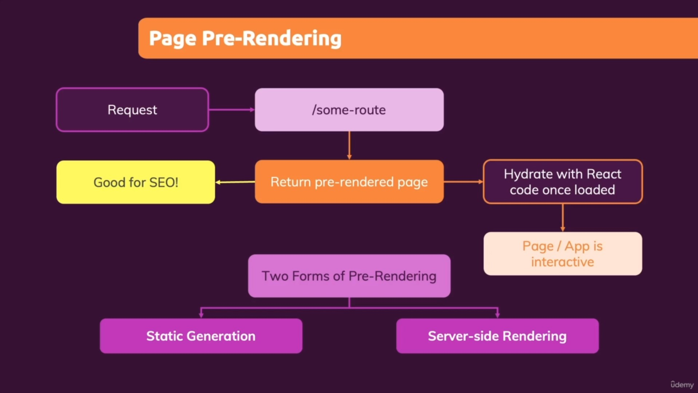

- course: nextjs-maximilianschwarzmuller-nextjs14-and-react-the-complete-guide

  - https://www.udemy.com/course/nextjs-react-the-complete-guide/
  - https://github.com/mschwarzmueller/nextjs-complete-guide-course-resources

- NOTE: this is the 2024 next14 update

## Table of contents

### APP ROUTER
[Section 01 - getting started](#section-01---getting-started-22min)

[Section 02 - OPTIONAL - React refresher](#section-02---optional---react-refresher)

[Section 03 - NextJS essentials - App Router](#section-03---nextjs-essentials---app-router)

[Section 04 - Routing and Page Rendering - Deep Dive](#section-04---routing-and-page-rendering---deep-dive)

[Section 05 - Data Fetching - Deep Dive](#section-05---data-fetching---deep-dive)

[Section 06 - Mutating Data - Deep Dive](#section-06---mutating-data---deep-dive)

[Section 07 - Understanding & Configuring caching](#section-07---understanding--configuring-caching)

[Section 08 - NextJs app optimizations](#section-08---nextjs-app-optimizations)

[Section 09 - user authentication](#section-09---user-authentication)

[Section 10 - round up and next steps](#section-10---round-up-and-next-steps)

### PAGE ROUTER
[Section 11 - Pages & File-based routing](#section-11---pages--file-based-routing)

[Section 12 - Project Time: working with file-based routing](#section-12---project-time-working-with-file-based-routing)

[Section 13 - page pre-rendering and data-fetching](#section-13---page-pre-rendering-and-data-fetching)

[Section 14 - project time: page pre-rendering & data-fetching](#section-14---project-time-page-pre-rendering--data-fetching)

[Section 15 - optimizing Next.js apps](#section-15---optimizing-nextjs-apps)

//FULL STACK REACT

[Section 16 - adding backend code with API Routes (fullstack react)](#section-16---adding-backend-code-with-api-routes-fullstack-react)

[Section 17 - Project time: API Routes](#section-17---project-time-api-routes)

[Section 18 - App-wide state (react context)](#section-18---app-wide-state-react-context)

[Section 19 - complete app example (build a full blog A-Z)](#section-19---complete-app-example-build-a-full-blog-a-z)

[Section 20 - Deploying Nextjs apps](#section-20---deploying-nextjs-apps)

[Section 21 - Adding Authentication](#section-21---adding-authentication)

[Section 22 - Optional Nextjs Summary](#section-22---optional-nextjs-summary)

[Section 23 - Course Roundup](#section-23---course-roundup) 

---

# Section 01 - getting started (22min)
[back (table of contents)](#table-of-contents)

## 02 What is nextjs?

- framework ontop of reactjs
- FEATURE: nextjs has route setup and handling
- FEATURE: nextjs has form handling
- FEATURE: nextjs has data fetching
- FEATURE: nextjs has authentication

## 03 Key features

- allows fullstack (front + backend)
- file based routing
- server side rendering (nextjs pre-renders on server)

## 04 creating a first nextjs app

- download src: https://github.com/mschwarzmueller/nextjs-complete-guide-course-resources/blob/main/attachments/01-getting-started/starting-project.zip
- install with pnpm (same as npm but shares node package libraries globally for all codebases)

```powershell
//install pnpm on windows -> powershell (admin)
iwr https://get.pnpm.io/install.ps1 -useb | iex
```

or create a new project

- asks questions from cli:

1. typescript? no (course)
2. eslint? yes
3. tailwindcss? no
4. src/ directory? no (course)
5. app router? yes (course)
6. import alias? no (course)

```cmd
npx create-next-app@latest
```

### run project

- see package.json commands

```
pnpm run dev
```

## 05 nextjs vs just react - analyzing the nextjs project

- nextjs -> html page content is rendered on server and sent from server to client
- vanilla react -> single html file with client side js code -> generated and rendered client side

## 06 routing -> editing the starting-project

- nextjs uses the "app" folder for routing

### creating a route

- APP Router -> nextjs uses app/ folder
- CONVENTION: routing is done by creating folders inside app/ AND "page.js"
- inside app/ add a new folder "awesome" (this will be the route) AND new pages are created by naming them "page.js"
- the above can be accessed

```
http://localhost:3000/awesome
```

- page should return jsx of what to render
- need default exports
- When you use export default, it allows Next.js to import the component without specifying the exact name of the import. default exports make it easier for Next.js to work with file-based routing and generate routes automatically.

## 07 page router vs app router (one framework, two approaches)

- page router (older)
- app router (course) -> introduced nextjs 13 -> supports react server components and server actions

## 10. course setup
- (2024-05) max adds a lesson 10 to section 1 to use Jetbrains IDE (thats what the whole lesson is about) 
- which throws out the numbering for the rest of the course by 1. 
- its quite annoying because it doesnt actually add any benefit to the rest of the lessons BUT it does affect lesson order.
- so all lessons up to Section 04 - Routing and Page Rendering - Deep Dive are renumbered (adjustment of +1) 
- see affected lessons in git commit history

---

# Section 02 - OPTIONAL - React refresher 
[back (table of contents)](#table-of-contents)

- 7hrs 41min - lesson 10-89 (lesson 47+ is legacy lessons)
- NOTE TO SELF: DO NOT REDO THESE LESSONS AGAIN -> YOU KNOW IT!!

- source code snapshot -> https://github.com/academind/react-complete-guide-course-resources/tree/main/code/30%20React%20Summary
- for convenience section files: 02-react-refresher/

- react refresher -> going over the basics
- imperative approach -> manipulating dom (step by step)
- declarative approach -> write ui code and blend with js, event listeners, state, and dynamic values
- vite install (install in current folder vite react template):

```cmd
pnpm create vite . --template react
```

## 22. CSS Modules

```css
/* Post.module.css */
.post {
  font-size: 1.5rem;
}
```

- css modules -> filename Post.module.css / import classes from "./Post.module.css"
- access the css: classes used in css can be accessed as properties of imported object ("classes")
  `<div className={classes.post}></div>`

## 26. state

- react components only refresh/reload with state updates eg. const [state, update state function] = useState() hooks
- react components DO NOT UPDATE without state updates
- OPTIMIZATION: when working with state and it depends on previous state, pass to the useState() set function a function that receives previous state (you can name this anything)

```js
function PostList() {
  const [posts, setPosts] = useState([]);

  function addPostHandler(postData) {
    setPosts((existingPosts) => [postData, ...existingPosts]); //optimized way by passing function that receives prev state
  }

  return <>//...</>;
}
```

## 31. react form buttons / 32. handling submit

- by default clicking button submits form
- give button type=""button" so it doesnt trigger form submit or give type="submit" to submit (optional as it will by default submit)
- form should have onSubmit handler that passes event and calls event.preventDefault();

```js
function NewPost({onAddPost, onCancel}){

  const [enteredBody, setEnteredBody] = useState();

  function submitHandler(event){
    event.preventDefault();

    const postData = {
      body: enteredBody
    }
    onAddPost(postData);

    //close modal
    onCancel()
  }

  function bodyChangeHandler(e){
    setEnteredBody(e.target.value);
  }

  return {
    <form onSubmit={submitHandler}>
      <p>
        <label htmlFor="bodyText">Text</label>
        <textarea onChange={bodyChangeHandler}/>
      </p>

      <button type="button">cancel</button>
      <button>submit</button>
    </form>
  }
}
```

## 36. sending a POST HTTP Request

- frontend to backend communication
- use fetch(url, {}) to send and get data
- fetch is not react only feature, it is in all browsers
- second param is a config object.. the body attribute is js that needs to be converted -> JSON.stringify()
- fetch awaits response

```js
function addPostHandler(postData) {
  //submit form
  fetch("http://localhost:8080/posts", {
    method: "POST",
    body: JSON.stringify(postData), //convert to json
    headers: {
      "Content-Type": "application/json",
    },
  });

  setPosts((existingPosts) => [postData, ...existingPosts]); //optimized way by passing function that receives prev state
}
```

## 37. Handling Side effects with useEffect()

- frontend sends a fetch request to /posts on backend which when done returns "posts"

### backend

```js
app.get("/posts", async (req, res) => {
  const storedPosts = await getStoredPosts();
  res.json({ posts: storedPosts });
});
```

- handle feedback from fetch

### frontend ANTIPATTERN... DO NOT DO THIS ON FRONTEND

- ANTIPATTERN -> .then() handling causes infinite loop because updating the state eg. calling setPosts() in the then() causes component to re-render -> which causes fetch to be called again

### UseEffect() -> frontend FIX for handling fetch() request

- FIX: handling should be done with useEffect() as it prevents infinite loop
- when is useEffect() called depends on the array (second prop)
  - always called -> no second prop
  - called at start -> empty array
  - called when dependency changes -> put dependencies in the array...when anything inside array changes, the useEffect is called.
- to call an async function inside the useEffect, define a nested inner async function
- useEffect() should not be async

```js
function PostList() {
  // fetch().then(response=> response.json()).then(data=> {setPosts(data.posts)});
  const [posts, setPosts] = useState([]);

  useEffect(() => {
    async function fetchPosts() {
      const response = await fetch("");
      const resData = await response.json();
      setPosts(resData.posts);
    }
    fetchPosts();
  }, [posts]);
}
```

## 39. routing

- react allows you to use your own routing.
- have a look at https://github.com/clarklindev/react-router-6 the code is self explanatory
- react router 6
- routing happens on client side

## 41. layout routes and outlet

- you can make layout routes by adding `<Route>` children to a `<Route>`
- organize routing into its own folder
- you tell react where to render the content of the route in the layout via the `<Outlet/>` from react-router-dom
- Outlet jsx element is a placeholder for where nested route can render their content in the RootLayout

### install latest react router

```cmd
pnpm i react-router-dom
```

```js
//routes/RootLayout.jsx
import {Outlet} from 'react-router-dom';
import MainHeader from '../components/MainHeader';

function RootLayout(){
  return (<>
    <MainHeader/>
    <Outlet/>
  <>);
}

export default RootLayout;

```

- import {RouterProvider, createBrowserRouter, createRoutesFromElements, Route} from 'react-router-dom';
- RouterProvider takes a "router" prop which you provide an route configuration object
- use createBrowserRouter to create a route config object
- then pass it as a value to RouterProvider's router prop

### METHOD A (array) -> createBrowserRouter([]) array method

- createBrowserRouter() takes an array as an value (a list of route definitions)
- a route definition is an object with a path and element that should be rendered when route is active `{path:"/", element:<App/> }`
- can add more routes to array and use layout route with children prop (array)

```js
import {RouterProvider, createBrowserRouter} from 'react-router-dom';
import Posts from './Posts';
import RootLayout from './routes/RootLayout';

//METHOD 1 - normal withoutlayout
const route = createBrowserRouter([
  {path:"/", element:<Posts/> }
]);

//METHOD 2 - can add more routes to array and use layout route
const route = createBrowserRouter([
  {path:"/", element:<RootLayout/>},
  children:[ {path:"/", element:<Posts/>}, {path:"/create-post", element:<NewPost/>} ],
]);

//...
ReactDOM.createRoot(document.getElementById('root')).render(
  <RouterProvider router={route}/>
)
```

### METHOD B (JSX) -> createBrowserRouter(createRoutesFromElements()) method

- OR you can pass to createBrowserRouter createRoutesFromElements(): `createBrowserRouter(createRoutesFromElements(<Route path='about' element={<About />} />))` and nest jsx of Route elements

```js
import {
  RouterProvider,
  createBrowserRouter,
  createRoutesFromElements,
  Route,
} from "react-router-dom";
import Posts from "./Posts";

const route = createBrowserRouter(
  createRoutesFromElements(<Route path="/" element={<Posts />} />)
); //can add more <Route> components as children of <Route></Route>

//...
ReactDOM.createRoot(document.getElementById("root")).render(
  <RouterProvider router={route} />
);
```

## 43 linking and navigation

### Link element

- in react, use Link component: `import {Link} from 'react-router-dom';`
- the right element for creating a link: `<a/>` that navigates a url BUT it creates a new request
- Link renders an `<a/>` element but it prevents the browser default of sending a request
- Link has "to" prop instead of "href"
- whereas `<button>` is more for when action occurs within page

```js
//causes new request to be sent to server
<a href="/create-post">new post</a>;

//does not send new request to server
import { Link } from "react-router-dom";
<Link to="/create-post">new post</Link>;
```

### navigation with code (navigate programatically)

- navigating using code
- useNavigate hook: import {useNavigate} from 'react-router-dom';
- can use .. to navigate to parent route

```js
import { useNavigate } from "react-router-dom";

const navigate = useNavigate();

function closeHandler() {
  navigate("/");
  navigate(".."); //navigate up one level
}
```

## react-router 6.4: to handle data-fetching and submitting form data

## 44. loader

- instead of using useEffect(), go to route definition... to the route that needs loader for data...
- add loader property, value is a function that will execute whenever the route gets activated (ie. when its about to render the route element)
- convention is to go to the route's component file and add export an extra function: loader
- and instead of putting code in route definition (just import and call it)
- loader() executes client side
- it can/or not return a promise, it will await for data to load first before rendering the route component
- loader should return data that is needed for active route
- then in main route definition file, import the loader: import Posts, {loader} from './Posts';
- give loader an alias if there is more loaders from different routes: postsLoader

### consuming loader() data with useLoaderData hook

- import {useLoaderData} from 'react-router-dom'
- to consume the loader() data for the route component (or any nested component), use the useLoaderData hook
- here PostsList is nested in Posts but we will consume the loader data there...

```js
// Posts.jsx
function Posts() {
  return (
    <>
      <Outlet />
      <main>
        <PostsList />
      </main>
    </>
  );
}
export default Posts;

export async function loader() {
  const response = await fetch("");
  const resData = await response.json();
  return resData;
}
```

- PostsList gets access to loader() data via useLoaderData hook
- removes the need for useEffect inside PostsList

```js
//PostsList.jsx
import { useLoaderData } from "react-router-dom";
function PostsList() {
  //BELOW COMMENTED OUT -> DEPRECATED for useLoaderData()
  // const [posts, setPosts] = useState([]);

  // useEffect(()=>{
  //   async function fetchPosts(){
  //     const response = await fetch('');
  //     const resData = await response.json();
  //     setPosts(resData.posts);
  //   }
  //   fetchPosts();

  // }, [posts]);

  const posts = useLoaderData();
}
```

```js
//main.jsx
import Posts, {loader as postsLoader} from './Posts';

const route = createBrowserRouter([
  {path:"/", element:<RootLayout/>},
  children:[
    {
      path:"/",
      element:<Posts/>,
      // loader: ()=>{},
      loader: postsLoader,
      children:[
        {
          path:"/create-post",
          element:<NewPost/>,
          // action:()=>{}
        }
      ]
    },
  ],
]);
```

## 45. action() functions for handling form submits

- when you have a form on a page, you can handle the submits with action() handlers, you also put the function close into the route component code
- it is triggered when form is submitted
- move the submit request code from submitHandler() to action() handler
- to handle forms with react-router, add "name" attribute to form elements
- by default `<form>` will try submit form data to server BUT...
- to use React router to handle form, use `<Form method="post">` (note Form with capital F) component: import {Form} from 'react-router-dom';
- `<Form method="post">` component will cause react router to call the action() assigned to the route component containing the form
- action(data) receives data argument which can be destructed, data is just a object..has eg. request property containing the "request" object generated by react-router
- the request object has a formData() method which gives access to the data encoded in the form
- formData() yields a promise, so change to use async/await
- to get data from formData -> const postData = Object.fromEntries(formData); //{body:'...', author:'...'}

```js
export async function action({ request }) {
  const formData = await request.formData();
  // formData.get('body') get form data
  const postData = Object.fromEntries(formData); //{body:'...', author:'...'}
  //...
}
```

- react router dom provides redirect() for what happens after form is sent
- redirect() generates a response object, which is then returned by action() function and react-router will check if its a redirect, and if it is, it will go to that route

```js
//NewPost.jsx
import { Form, redirect } from "react-router-dom";

function NewPost() {
  return (
    <>
      <Form method="post">
        <p>
          <label htmlFor="body">Text</label>
          <textarea id="body" name="body" />
        </p>
      </Form>
    </>
  );
}

export async function action({ request }) {
  const formData = await request.formData();
  // formData.get('body') get form data
  const postData = Object.fromEntries(formData); //{body:'...', author:'...'}

  //request object
  const response = fetch("http://localhost:8080/posts", {
    method: "POST",
    body: JSON.stringify(postData), //convert to json
    headers: {
      "Content-Type": "application/json",
    },
  });

  return redirect("/"); //return a response object from action
}
```

```js
//main.jsx
import NewPost, {action as newPostAction} from './routes/NewPost';

const route = createBrowserRouter([
  {path:"/", element:<RootLayout/>},
  children:[
    {
      path:"/",
      element:<Posts/>,
      // loader: ()=>{},
      loader: postsLoader,
      children:[
        {
          path:"/create-post",
          element:<NewPost/>,
          // action:()=>{}
          action: newPostAction
        }
      ]
    },
  ],
]);
```

## 46. Dynamic Routes with react-router

- use syntax: `{path:':id'}` in the router config
- note: absolute path has '/' eg. `{path:'/:id'}`
- note: relative path is eg. `{path:':id'}`
- to get the dynamic route id from the router config object, loader() function also receives an object with 'params' attribute which you can destruct to access the dynamic id
- the attribute name is the same as what is defined in the router config object eg. if route object is {path:':id'} then you access params.id

```js
export async function loader({ params }) {
  const response = await fetch("http://localhost:8080/posts/" + params.id);
  const resData = await response.json();
  return resData.posts;
}
```

---

# Section 03 - NextJS essentials - App Router
[back (table of contents)](#table-of-contents)

- lessons 86 -> 134
- 49 lessons
- 4hrs 1min
- module summary: https://www.udemy.com/course/nextjs-react-the-complete-guide/learn/lecture/41159816

## NEXT.JS CORE ESSENTIALS

- routing, pages, components
- fetching and sending data
- styling, images, metadata

## 87. starting setup

- project folder-> 03-nextjs-essentials-app-router/

## 88. file based routing + react server components

- app/ folder where you setup pages of website
- page.js reserved filename -> Nextjs ensures its rendered on server (server component)

## 89. Adding another route via the file system

- Important: These filenames are only reserved when creating them inside of the app/

- reserved filenames (1min42sec)

  - page.js -> define page content
  - layout.js -> wrap around pages
  - not-found.js -> not-found fallback page
  - error.js -> error fallback page
  - loading.js -> Fallback page which is shown whilst sibling or nested pages (or layouts) are fetching data
  - route.js -> Allows you to create an API route (i.e., a page which does NOT return JSX code but instead data, e.g., in the JSON format)

- routes are created by adding folders to app/ (with name as anything you want for the route) AND ALSO NEED a page.js
- eg. app/about/page.js
- page.js is just a default exported function
- then you can access the url via http://localhost:3000/about

```js
//AboutPage.jsx
export default function AboutPage() {
  return (
    <main>
      <h1>about us</h1>
    </main>
  );
}
```

## 90. Navigating between pages

### WRONG WAY

- using `<a>` elements causes page reload instead of single page app (SPA) environment where click just updates page with client javascript.

```js
<a></a>
```

### CORRECT WAY

- use `<Link>`
- NOTE: import Link from 'next/link';
- NOTE: NOT import {Link} from 'next/link';
- import Link from 'next/link';
- difference between react-router which uses "to" -> nextjs Link still uses "href" prop

## 91. working with pages and layouts

- a layout defines the "shell" around one or more pages
- its the layout of how the page should be rendered
- every project needs atleast one root layout: app/layout.js
- you can have other layouts inside app/route folders
- layout includes `<html>` and `<body>`
- layout DOES NOT have a `<head>` `but includes and an exported metadata object which includes all content that goes into head.
- children is the content of the page

```js
//app/layout.js
import "./globals.css";

export const metadata = {
  title: "NextJS Course App",
  description: "Your first NextJS app!",
};

export default function RootLayout({ children }) {
  return (
    <html lang="en">
      <body>{children}</body>
    </html>
  );
}
```

## 92. reserved file names, custom components, & how to organize a nextjs project

- Important: These filenames are only reserved when creating them inside of the app/
- https://nextjs.org/docs/app/api-reference/file-conventions

### import css

```js
import "./global.css";
```

### Favicon

- if you add an image called "icon" to app/ it will use it as an favicon

### components

- convention is to create a components/ folder parrallel to app/
- https://nextjs.org/docs/app/building-your-application/routing/colocation

### import alias

- in nextjs you can target root in your imports to make absolute path
- eg. import @/components/header
- this is configured in jsconfig.json

```js
//jsconfig.json
{
  "compilerOptions": {
    "paths": {
      "@/*": ["./*"]
    }
  }
}
```

## 95. Dynamic Routes -> configuring dynamic routes, using route parameters

- test links: http://localhost:3000/blog and http://localhost:3000/blog/post-1
- nextjs uses square brackets to denote something is dynamic: `[name]` where name is any placeholder
- so it will look like `app/blog/page.js` and `app/blog/[slug]/page.js`
- Nextjs passes a props to page components, and you can destruct this prop to retrieve "params".
- params is an object where every placeholder in a dynamic route ([slug]) will be a key, and the value stored is the actual URL value.
- eg.
  - if dir structure is `app/blog/[slug]/page.js`
  - url to access the page is: `localhost:3000/blog/page-1`
  - params.slug value is "page-1"

### Potential Blockers

- NOTE CORRECT: `import Link from 'next/link';` //no curly braces {} around Link
- NOTE INCORRECT: `import {Link} from 'next/link'`;
- not in correct folder

```js
//app/blog/page.js
import { Link } from "next/link";

export default function BlogPage() {
  return (
    <main>
      <Link href="/blog/post-1">post1</Link>
      <Link href="/blog/post-2">post2</Link>
    </main>
  );
}
```

```js
//app/blog/[slug]/page.js
export default function BlogPostPage({ params }) {
  return (
    <main>
      <h1>blog post</h1>
    </main>
  );
}
```

## 95. Onwards to the Main Project: The Foodies App

- exercise source: [github](https://github.com/mschwarzmueller/nextjs-complete-guide-course-resources/blob/main/attachments/02-nextjs-essentials/foodies-starting-project.zip)
- /03-2-foodies
- note: `meals/share` route has precedence over the dynamic route `/meals/[slug]` even though they both have /meals parent folder

## 96. EXERCISE / 97. EXERCISE SOLUTION

- practice creating of routes / dynamic routes
- run node project at: /03-2-foodies
- exercise todo:

1. create /meals route

- http://localhost:3000/meals

2. create /meals/share route

- http://localhost:3000/meals/share

3. create /community route

- http://localhost:3000/community

4. create a dynamic route

- /meals/[slug]
- dynamic url eg. http://localhost:3000/meals/pasta

## 98. layouts

- layouts wrap other pages
- access the wrapped content via props' children attribute

```js
export default function ExampleLayout({children}){
  return <>
    {children}
  <>
}

```

## 99. adding a custom component

- here we create our own header component with react

### Images

- if you import an image into a file, react auto creates the path
- NextJS you have to access the imported file via .src
- remember when importing if you use the alias @ in the import path (jsconfig.json) it is absolute path from root folder eg. @/assets/logo.png
- NOTE: `` element is standard html here... we will later use NextJs `<Image>` component see lesson 100

```js
//app/components/main-header.js

import Link from "next/link";
import logoImg from "@/assets/logo.png";

export default function MainHeader() {
  return (
    <header>
      <Link href="/">
        
        Food logo
      </Link>

      <nav>
        <ul>
          <li>
            <Link href="/meals">Browse Meals</Link>
          </li>
          <li>
            <Link href="/community">Food Community</Link>
          </li>
        </ul>
      </nav>
    </header>
  );
}
```

```js
import MainHeader from '@components/main-header';

//app/layout.js
export default function ExampleLayout({children}){
  return <>
    <MainHeader/>
    {children}
  <>
}

```

## 100. Styling Nextjs

- options: tailwind or cssmodules
- see lesson ## 21. CSS Modules
- if you name your css .module.css (classes are scoped),
- every class in the css file will be accessible via the import object as a property

```css
/* components/main-header.module.css */
.header {
  display: flex;
  justify-content: space-between;
  align-items: center;
  padding: 2rem 1rem;
}
```

```js
import classes from "./main-header.module.css";

export default function Test() {
  return (
    <>
      <div className={classes.header}>Hi</div>
    </>
  );
}
```

### 101. Optimizing Images with Nextjs <Image> component

- https://nextjs.org/docs/app/api-reference/components/image
- Nextjs has an Image component which assists with optimizing images
- optimizations: eg. auto lazy loading under-the-hood -> only display image if really visible on page
- note: the Image src prop is assigned the object imported...
- Image has loading="lazy" automatically added
- width and height is inferred
- srcset attribute added ensuring different sized images are loaded depending on viewport/device
- serve in best image format eg. .webp when using chrome
- priority property -> to tell nextjs to load image as quickly as possible

### Image vs img

- see lesson ## 98. adding a custom component -> Images where an `` element is used
- difference between using img element: using `` you assign src="" the imported object.src

```js
import Image from "next/image";
import logoImg from "@assets/logo.png";

// ...
<Image src={logoImg} priority />; //note: assign the full object imported (and not the .src property (logoImg.src)
```

## 102. using more custom components

- PRACTICE LESSON... (NOTHING NEW)
- here you create a custom components/main-header/main-header-background.js component
- and refactor some of the css into css module
- in main-header.js: import MainHeaderBackground from "./main-header-background";
- main-header-background: return the background svg wrapped in `<div className={classes['header-background']}>`

## 103. populating the starting content

- PRACTICE LESSON... (NOTHING NEW)
- editing app/page.js
- div: creating a image slideshow
- div: a hero div with some text
- div: call-to-action with some links
- add app/page.module.css

## 104. preparing image slideshow

- nextjs working with `<Image>`
- components/images/image-slideshow.js
- components/images/image-slideshow.module.css
- NOTE: image-slideshow is importing with `import x from '@assets/x.jpg';`
- then an image array is created referencing the imports
- image-slideshow then creates Image element for each item in array
- useState to keep track of index in array,
- useEffect called once that creates const interval = setInterval(()=>{})
- setInterval that updates this useState() index calling useState's set method
- the set method has a method that just checks if current index is lower than the array length, if so +1 else set index to 0
- make sure to add cleanup function by return ()=>{//clearInterval(interval)}

### ERROR ERROR ERROR!

- note you get an error from above (react server component error - you're importing a component that needs useState. it only works in a client component, but none of its parents are marked with "use client", so they're Server components by default)

## 105. React Server components vs Client Components

- by default in nextjs all components are server side components (rendered on server)
- you can see the difference by testing if your console.logs show in browser or cmd/terminal (where you run the project)
- SO even tho everything is server components, you can still render it as a client-side components...
- and these need to be client-side components:
  - react hooks are a client-side concept
  - event handlers are client-side concept

### 'use client'

- if you want to build a client-side component have to declare 'use client'; (at top of file):

```js
"use client";
```

## 106. creating NavLink -> using client components efficiently

- /app/community/page.js
- /app/community/page.module.css

### usePathname -> getting active path to set active Link class

- externalize Link to NavLink component so only that part is client-side component...
- NEXTJS usePathname hook
- NOTE: usePathname is a hook (this should ring a bell ...DING!! -> SERVER COMPONENT requires 'use client';)
- NOTE: you want to add 'use client'; as far down the component tree as possible SOLUTION -> create a components/nav-link.js (NavLink)
- getting active path so you can set the class
- use path to test if it startsWith (nested pages) eg '/meals' OR equals string match
- if it does then you know it should be active

```js
//app/components/main-header/main-header.js
import NavLink from "./nav-link";

//...
return (
  <nav>
    <NavLink href="/meals">Browse Meals</NavLink>
    <NavLink href="/community">Community</NavLink>
  </nav>
);
```

```js
//components/main-header/nav-link.js
"use client";

import { usePathname } from "next/navigation";
import Link from "next/link";
import classes from "./nav-link.module.css";

export default function NavLink({ href, children }) {
  const path = usePathname();
  return (
    <Link
      href={href}
      className={path.startsWith(href) ? classes.active : undefined}
    >
      {children}
    </Link>
  );
}
```

## 107. meal details: output meal data & images with unknown dimensions

- PRACTICE LESSON... (uses dynamic route AND images dynamically loaded from db (no width/height at build-time) add "fill" attribute)

- ability to have a page which shows many items eg. meals (meals-grid)
- ability to share am item eg. a meal
- the purpose of meal detail page is to show the detail of one recipe

- meal-grid has many meal-items
- meal-item has a dynamic slot for the Link to open details page: `app/meals/[slug]/page.js`
- Image -> with import's nextjs can detect width/height.. but dynamically loaded from database, which is a path pointing to an image
- Image -> add "fill" attribute for dynamically loaded iamge: `<Image src={image} alt={title} fill />`

- app/meals/page.js
- app/meals/page.module.css
- components/meals/meals-grid.js
- components/meals/meals-grid.module.css
- components/meals/meal-item.js
- components/meals/meal-item.module.css

```js
//app/meals/page.js
export default function MealsPage() {
  return (
    <>
      <header className={classes.header}>
        <h1>
          meals <span className={classes.highlight}>by you</span>
        </h1>
        <p>choose a recipe</p>
        <p className={classes.cta}>
          <Link href="/meals/share">share your recipe</Link>
        </p>
      </header>
      <main>// meals grid here...</main>
    </>
  );
}
```

```js
//components/meals/meals-grid.js`
import MealItem from './meal-item';
import classes from './meals-grid.module.css';

export default function MealsGrid(meals){
  return (
    <ul className={classes.meals}>
      {
        meals.map( meal=> (
          <li key={meal.id}>
            <MealItem {...meal}/>
          </li>
        ));
      }
    </ul>
  );
}
```

## 108. setting up SQLLite database

- install sqlLite db
- add initdb.js to root, it will setup the db (if it doesnt exist -> or use existing db) -> dummy meals
- run initdb.js `node initdb.js` -> meals.db is created

```cmd
pnpm i better-sqlite3
```

```js
const sql = require("better-sqlite3");
const db = sql("meals.db");

const dummyMeals = [
  {
    title: "Juicy Cheese Burger",
    slug: "juicy-cheese-burger",
    image: "/images/burger.jpg",
    summary: "good burger",
    instructions: ``,
    creator: "John Doe",
    creator_email: "johndoe@example.com",
  },
];

db.prepare(
  `
   CREATE TABLE IF NOT EXISTS meals (
       id INTEGER PRIMARY KEY AUTOINCREMENT,
       slug TEXT NOT NULL UNIQUE,
       title TEXT NOT NULL,
       image TEXT NOT NULL,
       summary TEXT NOT NULL,
       instructions TEXT NOT NULL,
       creator TEXT NOT NULL,
       creator_email TEXT NOT NULL
    )
`
).run();

async function initData() {
  const stmt = db.prepare(`
      INSERT INTO meals VALUES (
         null,
         @slug,
         @title,
         @image,
         @summary,
         @instructions,
         @creator,
         @creator_email
      )
   `);

  for (const meal of dummyMeals) {
    stmt.run(meal);
  }
}

initData();
```

## 109. NEXTJS way of loading data from db

- with nextjs backend and frontend are blended seamlessly together (no need for separate backend)
- NOTE: because nextjs components are by default SERVER side components, you can reach out directly to db
- create a new folder eg. lib/ and create a file that reaches out to db and gets data
- sqllite:
  - "run()" is used when you insert/change data,
  - "all()" is used when fetching data (all rows)
  - "get()" to get single row
- sqllite does not use promises but they can be used in our component by converting them to async functions
- NOTE: async functions are allowed in NEXTJS at component level (not possible with react)

```js
//lib/meals.js
import sql from "better-sqlite3";
const db = sql("meals.db");

export async function getMeals() {
  //simulate delay
  // await new Promise((resolve)=> setTimeout(resolve, 2000));
  return db.prepare("SELECT * FROM meals").all();
}
```

```js
//app/meals/page.js
import {getMeals} from '@/lib/meals';

//- NOTE: here async is added at component level (allowed in NEXTJS)
export default async function MealsPage(){
  const meals = await getMeals();

  return (<>
    // ...
    <MealsGrid meals={meals}>
    </>
  )
}
```

## 110. adding a loading page

- adding a loading page (loading.js)
- closest loading.js becomes active page when page/nested-page is loading data
- NOTE:here loading page replaces entire screen

```js
//app/loading.js
import classes from "./loading.module.css";

export default function MealsLoadingPage() {
  return <p className={classes.loading}>fetching meals</p>;
}
```

## 111. using `<Suspense>` + streamed responses for granular loading state management

- it would be better if only the portion of data that is loading data shows loading
- to not use this file, rename "loading.js" to something else so it has no context within NextJS because loading.js is reserved filename (renamed to loading-out.js)
- TODO: externalize the loading part to its own function (eg. Meals()) which returns the jsx for meals component
- AND because it is loading something you can use the react fallback `<Suspense>` wrapper
- `<Suspense fallback={}>` needs you to define fallback content that should be shown while loading in the fallback attribute

```js
import Link from "next/link";
import classes from "./page.module.css";
import MealsGrid from "@/components/meals/meals-grid";
import { getMeals } from "@/lib/meals";

async function Meals() {
  const meals = await getMeals();
  return <MealsGrid meals={meals} />;
}

export default function MealsPage() {
  return (
    <>
      <header className={classes.header}>
        <h1>
          meals <span className={classes.highlight}>by you</span>
        </h1>
        <p>choose a recipe</p>
        <p className={classes.cta}>
          <Link href="/meals/share">share your recipe</Link>
        </p>
      </header>
      <main className={classes.main}>
        <Suspense fallback={<p className={classes.loading}>fetching meals</p>}>
          <Meals />
        </Suspense>
      </main>
    </>
  );
}
```

## 112. handling errors

- error.js files to handle errors when some error occurs eg. loading data fails
- error.js -> rendered by nextjs when error occurs (its a custom error page)
- NOTE: it only handles errors of page.js that sit in same folder OR that is in a nested layout -> so you can put at root folder to catch any errors
- we add to app/meals/error.js
- you can get more details about the error from the props of the error.js component -> "error" prop (OPTIONAL)
- the error component must be a client-side-component: `"use client";` to also catch errors on client-side
- simulate the error in lib/meals.js

```js
import sql from "better-sqlite3";

const db = sql("meals.db");

export async function getMeals() {
  //simulate delay
  //await new Promise((resolve)=> setTimeout(resolve, 2000));

  //simulate load error
  throw new Error("loading meals failed");

  return db.prepare("SELECT * FROM meals").all();
}
```

## 113. not-found

- can add to top-level of project to handle all not-found routes
- not-found.js file to handle invalid routes
- test with an invalid route
- uses globals.css
- NOTE: will show closest 'not-found' OR 'error' page,
- so if error is closer than not-found page, it will show error page if its closer, unless a not-found page is put at same level as the error page to make them equally close.

```js
//app/not-found.js
export default function NotFound({ error }) {
  return (
    <main className="not-found">
      <h1>Not found</h1>
      <p>could not find requested page/resource</p>
    </main>
  );
}
```

## 114. loading and rendering meal details using DYNAMIC ROUTES & ROUTE PARAMS

- using dynamic routes and route params to load item details
- `app/meals/[slug]/page.js`
- NOTE: `meals/[slug]/page/` uses dangerouslySetInnerHTML={{__html:'...'}} (potential cross-site-scripting attack vulnerability)
- it is an object and you set the actual html via \_\_html attribute
- get slug via params prop `const dynamicId = params.slug;`
- getMeal() returns a promise so make it async OR remove async from lib/meals.js getMeal() function
- and we can call getMeal() directly since its a server-side component: `const meal = getMeal(dynamicId);`
- replace placeholders with item props (eg. meal's props see initdb.js initData() for item attributes (db columns))
- fix line breaks -> `meal.instructions = meal.instructions.replace(/\n/g, '<br/>');`

```js
//app/meals/[slug]/page.js
import Image from "next/image";
import { notFound } from "next/navigation";

import classes from "./page.module.css";
import { getMeal } from "@/lib/meals";

export default function MealDetailsPage({ params }) {
  const meal = getMeal(params.slug); //note: this params.slug is the same naming as the dynamic route app/meals/[slug]

  if (!meal) {
    notFound();
  }

  meal.instructions = meal.instructions.replace(/\n/g, "<br/>"); //fix line breaks

  return (
    <>
      <header className={classes.header}>
        <div className={classes.image}>
          <Image src={meal.image} alt={meal.title} fill />
        </div>
        <div className={classes.headerText}>
          <h1>{meal.title}</h1>
          <p className={classes.creator}>
            by <a href={`mailto:${meal.creator_email}`}>{meal.creator}</a>
          </p>
          <p className={classes.summary}>{meal.summary}</p>
        </div>
      </header>
      <main>
        <p
          className={classes.instructions}
          dangerouslySetInnerHTML={{ __html: meal.instructions }}
        ></p>
      </main>
    </>
  );
}
```

- NOTE: here you are using a slug prop to access the DB
- INSECURE WRONG WAY: `return db.prepare('SELECT * FROM meals WHERE slug = ' + slug);` //insecure
- SECURE WAY -> FIX TO PROTECT FROM SQL ATTACKS: use "?" and .get() passing ? value to get(): `return db.prepare('SELECT * FROM meals WHERE slug = ?').get(slug);`

```js
//lib/meals.js
import sql from "better-sqlite3";

const db = sql("meals.db");

export async function getMeals() {
  return db.prepare("SELECT * FROM meals").all();
}

export async function getMeal(slug) {
  // return db.prepare('SELECT * FROM meals WHERE slug = ' + slug);  //insecure
  return db.prepare("SELECT * FROM meals WHERE slug = ?").get(slug);
}
```

## 115. throwing not found for individual meals

- practice (NOTHING NEW)
- `import { notFound } from 'next/navigation';`
- shows closest error or not-found page if you call notFound() -> stops component from executing

## 116. share meals form -> this is C of CRUD (create meals)

- working with form
- create a meal
- app/meals/share/page.js
- app/meals/share/page.module.css

## 117. image picker input component

- create an image picker to allow user to upload image on the form AND preview uploaded image
- `<input className={classes.input} type="file" id={name} accept="image/png, image/jpeg" name={input}/>`
- we are hiding the default input picker button and adding our own buton.
- our button has type="button" so it doesnt submit the form (default is type submit)
- the button should click the hidden input type="file"
- BUT now error because eventHandlers are client side
- add "use client";
- use useRef from React to reference hidden input via ref.current eg. `const imageInput = useRef() `and trigger a click: `imageInput.current.click()`
- you can allow user to upload multiple files by adding "multiple" attribute to input

## 118. image preview for image picker

- handle image pick event
- use state to store the picked image
- and show preview
- use an onChange={} to call a function to handle the uploaded image
- then use `event.target.files[0]` to access the upload
- to show image preview, convert the uploaded data to data-url (a value that can be used for an input when working with image)
- get hold of the fileReader value using `fileReader.onload = ()=>{}`
- so the function assigned to onload is called when fileReader is done and you will be able to access file via `fileReader.result` (which is what we want to set in state)
- note useState is good usecase because if the browser refreshes we loose the state (which is what we want)

## 119. image picker improvements

1. Reset the previewed image if no image was selected - Add set setPickedImage(null); to the if(!file) block
2. Add the required prop to the (hidden) `<input>` element - This ensures that the `<form>` can't be submitted without an image being selected.

```js
//app/components/meals/image-picker.js

"use client";
import { useRef } from "react";

import classes from "./image-picker.module.css";

export default function ImagePicker({ label, name }) {
  const [pickedImage, setPickedImage] = useState();

  const imageInput = useRef();

  const handlePickClick = () => {
    imageInput.current.click();
  };

  const handleImageChange = (event) => {
    const file = event.target.files[0];

    if (!file) {
      setPickedImage(null);
      return;
    }

    const fileReader = new FileReader();
    fileReader.onload = () => {
      setPickedImage(fileReader.result);
    };
    fileReader.readAsDataURL(file);
  };

  return (
    <div className={classes.picker}>
      <label htmlFor={name}>{label}</label>
      <div className={classes.preview}>
        {!pickedImage && <p>no image picked yet..</p>}
        {pickedImage && <Image src={pickedImage} alt="selected image" fill />}
      </div>
      <div className={classes.controls}>
        <input
          ref={imageInput}
          className={classes.input}
          type="file"
          id={name}
          accept="image/png, image/jpeg"
          name={name}
          onChange={handleImageChange}
          required
        />
        <button
          className={classes.button}
          type="button"
          onClick={handlePickClick}
        >
          pick an image
        </button>
      </div>
    </div>
  );
}
```

## 120. NextJS handling form submissions (server actions) with "use server";

- form submission handling with NEXTJS

- OPTION 1: normal method attach action handler for handling `<form onSubmit={}>` -> prevent default, collect data, send to backend

### server action

- OPTION 2: NEXTJS/REACT way -> create a function in the component that has the form and call "use server"; which ensure the code is run only on server
- AND need to add "async" to the function
- assign the server function as a value to the action prop of form
- the action function receives `formData` object (FormData) which you can access form field that have "name" properties via `get()`
- to also retrieve Image pickers values also need to give it label and name attribute
- the image should be stored in file system and a path stored in the db.
- by defining "use server"; ensures function code is run server-side
- without "use server" - code is run client-side and you would need to send form data to backend via fetch()

```js
//app/meals/share/page.js
export default function ShareMealPage() {
  //server action
  async function shareMeal(formData) {
    "use server"; //-----> note: use server is inside function

    const meal = {
      title: formData.get("title"),
      summary: formData.get("summary"),
      instructions: formData.get("instructions"),
      image: formData.get("image"),
      creator: formData.get("name"),
      creator_email: formData.get("email"),
    };

    console.log(meal);
  }

  //...
  return <form action={shareMeal}></form>;
}
```

## 121. storing server actions in separate files

- you can create server action functions but only if the component is NOT using "use client";
- can store server actions in separate files: lib/actions.js
- when defining actions in a separate file with 'use server'; ontop, all functions are treated as server actions
- TODO: move shareMeal() server action function to its own file lib/actions.js
- remove 'use server' from within the function as it is defined at top of file
- app/meals/share/page.js -> the shareMeal function needs to be imported
- with this change you CAN IF NEEDED convert app/meals/share/page.js as client-side code

```js
//app/lib/actions.js
"use server";

export async function shareMeal(formData) {
  const meal = {
    title: formData.get("title"),
    summary: formData.get("summary"),
    instructions: formData.get("instructions"),
    image: formData.get("image"),
    creator: formData.get("name"),
    creator_email: formData.get("email"),
  };

  console.log(meal);
}
```

## 122. creating a slug & sanitizing user input for XSS protection

- storing the form data (SQLLITE)
- add function saveMeal(meal) to lib/meals.js
- meal object has the format (see above)
- the slug should be generated from the title
- install slugify
- install xss (protect against cross-site scripting)
- therefore we need to sanitize content sent by user
- create slug `const slug = slugify(meal.title);`
- sanitize: `const instructions = xss(meal.instructions);`
- note: slug is added on the fly to meal
- note: instructions is overriding old instructions with the sanitized version

```cmd
pnpm i slugify xss
```

```js
//app/lib/meals
//...
import slugify from "slugify";
import xss from "xss";

export function saveMeal(meal) {
  //create slug
  meal.slug = slugify(meal.title, { lower: true });
  meal.instructions = xss(meal.instructions);
}
```

## 123. storing uploaded images + storing data in the database

- storing images in db is bad for performance
- we will store uploaded images in public folder. NOTE: this will be updated later to use AWS S3 buckets
- images stored in public/ will be publically available
- get the file extension
- generate a unique filename (not the same name of uploaded) + append extension
- to prevent clashing filename, add more randomness to the filename by adding a unique string to filename
- nodejs provide fs api to write files
- import fs from node:fs;

### SAVE FILE

### 1. create a stream

- use fs to writestream with createWriteStream() allows us to write data to a file
- fs requires a path to file we want to write (where to put it (including filename)) -> it returns an stream object you can use to write the file

### 2. create buffered image using arrayBuffer()

- to use the stream.write() to write to stream -> write() expects a chunk
- what is a chunck? the image should be converted to a buffered image (which is image broken up into parts) -> call arrayBuffer() method: `meal.image.arrayBuffer()`
- note: arrayBuffer() will return a Promise which will resolve to the buffer...
- await the .arrayBuffer() call and add async to the function

### 3. convert array buffer to regular buffer

- we just created an arrayBuffer() in previous step.
- convert to regular buffer: Buffer.from()
- the second prop to stream.write() is the function to call once done writing and it receives error as a prop if there are errors

### 4. overwrite the meal object's .image attribute

- the image is now saved to public/images/ folder BUT we will only store the path in db.
- override .image: meal.image = `/images/*image filename*`
- NOTE: public folder is seen as root and does not need to be included in the paths.

### STORE IN DATABASE

### 5. save to db

- call db.prepare():
- OPTION 1 -> `VALUES (?, ?, ?, ?, ?, ?, ?)` method OR
- OPTION 2 -> easier way is to look at /initdb.js initData() and put the @ values into the VALUES () (see below)
  - SQL indentation usually matters
  - you can target the specific fields by their name with the @ syntax and then later just pass an object to the run() function.
  - better-sqllite package will look at the property names in the object you're passing-in and extract the property values matching the @ properties in VALUES()
  - order matters VALUES needs to match INSERT order
  - VALUES() comma's matter.
- call .run() and pass meal object: run(meal)

### call shareMeal()

- in /lib/actions.js -> shareMeal() -> calls saveMeal(meal) and then redirects: redirect('/');

```js
//lib/meals.js
import fs from 'node:fs';

export function saveMeal(meal){
  //create slug
  meal.slug = slugify(meal.title, {lower: true});
  meal.instructions = xss(meal.instructions);

  const extension = meal.image.name.split('.').pop();
  const fileName = `${meal.slug}.${extension}`;

  //1.
  const stream = fs.createWriteStream(`public/images/${fileName}`);

  //2.
  const bufferedImage = await meal.image.arrayBuffer();

  //3.
  //use stream to write the file -> convert the arrayBuffer to regular Buffer
  stream.write(Buffer.from(bufferedImage), (error)=>{
    if(error){
      throw new Error('save failed');
    }
  });

  //4.
  meal.image = `/images/${fileName}`;

  //5.
  db.prepare(
    `
      INSERT INTO meals
        (title, summary, instructions, creator, creator_email, image, slug)
      VALUES (
        @title,
        @summary,
        @instructions,
        @creator,
        @creator_email,
        @image,
        @slug
      )
    `
  ).run(meal);
}

```

```js
//lib/actions.js
"use server";
import { redirect } from "next/navigation";
import { saveMeal } from "./meals";

export async function shareMeal(formData) {
  const meal = {
    title: formData.get("title"),
    summary: formData.get("summary"),
    instructions: formData.get("instructions"),
    image: formData.get("image"),
    creator: formData.get("name"),
    creator_email: formData.get("email"),
  };

  //console.log(meal);
  await saveMeal(meal);
  redirect("/");
}
```

## 124. Form submission status - useFormStatus()

- when form is being submitted -> give feedback to user that something is happening.
- React has useFormStatus() hook

```js
"use client";
import { useFormStatus } from "react-dom";

const status = useFormStatus();
//status.pending = ...
```

- useFormStatus() returns an object with some useful props which you can use object destructing to extract.
- eg. `.pending` property (boolean) true if there is an ongoing request, or otherwise false
- it requires a client component: "use client";
- NOTE: the useFormStatus() hook will only work if it is inside of the form (ie. a child component of `<form>`)
- you might not want the page to be a client side component just to conditionally update button

### DO THIS

- FIX: move to its own component: eg. FormSubmit
- made form submit component more generic by requiring user pass-in label `<FormSubmit label=""/>`

```js
//app/components/meals/form-submit.js
"use client";
import { useFormStatus } from "react-dom";

export default function FormSubmit({ label }) {
  const { pending } = useFormStatus();
  return (
    <button disabled={pending}>{pending ? "Submitting..." : label}</button>
  );
}
```

- using `<FormSubmit>` component

```js
///app/meals/share/page.js
import { shareMeal } from "@/lib/actions";
import FormSubmit from '@components/meals/form-submit';
...
export default function ShareMealPage() {
  return (
    <>
      <form action={shareMeal}>
        ...
        <ImagePicker label="your image" name="image" />
        <p className={classes.actions}>
          <FormSubmit label="share meal"/>
        </p>
      </form>
    </>
  );
}
```

## 125. server-side input validation

- should validate form values

### client-side-validation

- there is built in validation -> form fields have 'required' props to ensure cant submit empty values
- BUT... users can remove 'required' prop from form (developer tools) and then submit invalid values to the backend

### server-side-validation

- server action functions -> /lib/actions.js
- validate the formData values
- should actually use validator library/tools...
- if form data does not pass validation you can throw an error, but it destroys all form data sent
- add an error.js page for app/meals/share to catch the errors of app/meals/share/page.js (NOTE: there is better way to handle errors with useActionState())

```js
//lib/actions.js
// ...
export async function shareMeal(formData) {
  const meal = {
    title: formData.get("title"),
    summary: formData.get("summary"),
    instructions: formData.get("instructions"),
    image: formData.get("image"),
    creator: formData.get("name"),
    creator_email: formData.get("email"),
  };

  const isInvalidText = (text) => {
    return !text || text.trim() === "";
  };

  //validation:
  if (
    isInvalidText(meal.title) ||
    isInvalidText(meal.summary) ||
    isInvalidText(meal.instructions) ||
    isInvalidText(meal.creator) ||
    isInvalidText(meal.creator_email) ||
    !meal.creator_email.includes("@") ||
    !meal.image ||
    meal.image.size === 0
  ) {
    throw new Error("invalid input");
  }

  // ...
}
```

## 126. useFormState() / useActionState()

- ERROR -> Q&A says useFormState() works and useActionState() needs canary version of react and might not work with nextjs so use useFormState()

- useFormState -> note: useFormState is part of 'react-dom'
- useActionState will give an error like:

```ERROR
TypeError: (0 , react__WEBPACK_IMPORTED_MODULE_1__.useActionState) is not a function or its return value is not iterable
```

```js
import { useFormState } from "react-dom";
```

<!-- - NEW METHOD: useActionState -> note: useActionState is part of 'react'
- supported by canary version of react
```js
import { useActionState } from 'react';
``` -->

## 127. sever-action response object and useActionState()/useFormState() - handle validation more elagantly

- useFormState() works!
- useActionState() seems newer BUT only supported on React canary version..
- handle validation more elagantly in action functions by returning response objects (no methods allowed in this object)

```js
//lib/actions.js

//validation:
if (
  isInvalidText(meal.title) ||
  isInvalidText(meal.summary) ||
  isInvalidText(meal.instructions) ||
  isInvalidText(meal.creator) ||
  isInvalidText(meal.creator_email) ||
  !meal.creator_email.includes("@") ||
  !meal.image ||
  meal.image.size === 0
) {
  //throw new Error('invalid input');
  return {
    message: "invalid input",
  };
}
```

### useActionState() hook /useFormState() hook

- we can get the response object in the form (in our project it is the share page (app/meals/share/page.js) - the Create of CRUD) using useActionState() / useFormState() hook

```js
import { useFormState } from "react-dom";
//import { useActionState } from 'react';
```

- useActionState/useFormState is responsible for managing state of page or component that has a form that will be submited with server actions
- needs "use client";
- useActionState() / useFormState() needs 2 arguments:
  1. actual server action that should be triggered when form is submitted (shareMeal)
  - NOTE: using useActionState() / useFormState() the server action has a different structure: useActionState() / useFormState() will pass 2 parameters to the server action
  - eg. shareMeal() now receives 1st prop the previous state (possibly not used but required to include) and formData as before but as 2nd prop
  2. initial state of component before action response
- useActionState / useFormState will give array with 2 elements:
  1. state -> latest response from server action
  2. formAction -> which you should set on form action prop

### State

- state will then either be:
- A - initial state of component before action response
- B - response received back from shareMeal action function
- use returned state: `{state.message && <p>{state.message}</p>}`

```js
//app/meals/share/page.js

"use client";
// import { useActionState } from 'react';
import { useFormState } from "react-dom";
import { shareMeal } from "@/lib/actions";

export default function ShareMealPage() {
  // const [formState, formAction] = useActionState(shareMeal, {message:null}); //useActionState requires canary version of react
  const [formState, formAction] = useFormState(shareMeal, { message: null });

  //...
  <form className={classes.form} action={formAction}>
    ...
    {formState.message && <p>{formState.message}</p>}
  </form>;
  //...
}
```

```js
//lib/actions
export async function shareMeal(prevState, formData) {}
```

## 128. building for production and understanding nextjs caching

- moving development to production...
- `npm run build` prepare for production
- `npm start`

```cmd
npm run build
npm start
```

## 129. revalidatePath() -> triggering cache revalidations

- `import { revalidatePath } from 'next/cache';`
- you will see that nextjs caches the production pages so that even if you were to rebuild, the cache still exists
- you need to tell nextjs to throw away its cache when you add a meal (revalidate)
- call revalidatePath() to revalidate the cache() before route path eg.

```js
//lib/actions.js
import { revalidatePath } from "next/cache";

await saveMeal(meal);
// revalidatePath('/meals', 'layout')
revalidatePath("/meals");
redirect("/meals");
```

- if you use "layout" it revalidates all nested pages too, otherwise "page" only revalidates the page
- "page" is the default so can be omitted
- right before a redirect() is triggered to revalidate

## 130. dont store files locally on the filesystem

- public/ folder works for development, but in production nextjs copies public/ to `.next` folder
- and its the .next/ folder that will be used by the nextjs production server
- see nextjs "static assets" - https://nextjs.org/docs/pages/building-your-application/optimizing/static-assets
- USE third party storage services like aws s3

## 131. Storing Uploaded Images In The Cloud (AWS S3)

- NB lesson!
- working on git branch: aws-storing-images-in-aws-s3
- project folder: /03-3-foodies-image-storage-using-aws-s3
- TODO: update 03-2-foodies/ so that it stores images on [aws-s3](https://aws.amazon.com/s3/) bucket instead of locally in public folder

1. Create an AWS account

2. Create a S3 bucket

- navigate to s3 console
- create a bucket (container used to store files)
- every bucket has globally unique name
- use a prefix eg. <your-name>-nextjs-demo-users-image
- confirm default settings..

## READING IMAGES OFF AWS S3 BUCKET

3. Upload the dummy image files

- select the created bucket
- copy images to bucket (you can select multiple images in project public/) by clicking upload

4. Configure the bucket for serving the images

- configure the bucket such that the images can be loaded from the NextJS website
  NOTE: for security reasons, by default, files not accessible

### disable "Block all public access"

- TODO: we must update the bucket settings to make sure the images can be viewed by everyone.
- "Permissions" tab -> Edit Block public access (bucket settings) -> unselect "Block all public access" -> save changes

### add Bucket policy

- TODO: AND you must add a "Bucket Policy" (a policy document - that allows you to manage the permissions of the objects stored in the bucket)
- replace `DOC-EXAMPLE-BUCKET` with the bucket name (no quotes) -> save changes
- Now the bucket is configure to grant access to all objects inside of it to anyone who has a URL pointing to one of those objects.

```
{
  "Version": "2012-10-17",
  "Statement": [
    {
      "Sid": "PublicRead",
      "Effect": "Allow",
      "Principal": "*",
      "Action": [
          "s3:GetObject",
          "s3:GetObjectVersion"
      ],
      "Resource": [
          "arn:aws:s3:::DOC-EXAMPLE-BUCKET/*"
      ]
    }
  ]
}
```

### test if it works

- To test if everything works, click on one of the images you uploaded (in the bucket).
- Then click on the "Object URL" - if opening it works (and you can see the image), you configured everything as needed.

5. Update the NextJS code to use those S3 images

- update NextJS app to load images from aws-s3 bucket
- project folder -> empty out public/
- if you also delete the .next folder in the NextJS project and you then visit localhost:3000/meals, you should see a bunch of meals without images.

### update referenced images

- edit the database data by updating the initdb.js file:
  - Change all the image property values from image (ie. remove "/images/"): '/images/burger.jpg' to image: 'burger.jpg' (and do that for all meals).

```js
//before
<Image src={image} alt={title} fill />
//after
<Image src={`S3_URL_BUCKET_NAME/${image}`} alt={title} fill />
```

- goto: `components/meals/meal-item.js` and update image source (use string literal) by replacing "S3_URL_BUCKET_NAME" with
  the object url \*(get from AWS): eg. `https://maxschwarzmueller-nextjs-demo-users-image.s3.amazonaws.com`
- The new src value is a string that contains the S3 URL to your bucket objects (i.e., the URL you previously clicked for testing purposes - without the image file name at the end). The actual image name that should be loaded is then dynamically inserted via ${image}.
- Note: This will only work if the images stored in the S3 bucket have the names referenced in the initdb.js file!

### AND also update referenced images here...

- You should also update the app/meals/[mealSlug]/page.js file and make sure that the image on this page is also fetched from S3:

```js
<Image
  src={`https://maxschwarzmueller-nextjs-demo-users-image.s3.amazonaws.com/${meal.image}`}
  alt={meal.title}
  fill
/>
```

### RESET DB values

- reset the database data, you should delete your meals.db file (i.e., delete the SQLite database file) and re-run node initdb.js to re-initialize it (with the updated image values).

```cmd
node initdb.js
```

- NOTE: doing above step will cause an error:

```ERROR
Error: Invalid src prop (https://maxschwarzmueller-nextjs-demo-users-image.s3.amazonaws.com/burger.jpg) on `next/image`, hostname "maxschwarzmueller-nextjs-demo-users-image.s3.amazonaws.com" is not configured under images in your `next.config.js`
```

6. FIX -> NEXTJS: Allowing S3 as an image source

- by default, NextJS does not allow external URLs when using the `<Image>` component.
- You explicitly have to allow such a URL in order to get rid of this error
- This `remotePatterns` config allows this specific S3 URL as a valid source for images.
- NOTE: the hostname does not include "https://" as its defined under "protocol"
- in next.config.js:

```js
//next.config.js
/** @type {import('next').NextConfig} */

const nextConfig = {
  images: {
    remotePatterns: [
      {
        protocol: "https",
        hostname: "maxschwarzmueller-nextjs-demo-users-image.s3.amazonaws.com",
        port: "",
        pathname: "/**",
      },
    ],
  },
};

module.exports = nextConfig;
```

## SAVING IMAGES TO AWS S3 BUCKET

7. Storing uploaded images on S3

- when creating a meal, we upload an image and we should should forward this image to AWS S3.
- aws has a package: `@aws-sdk/client-s3` that allow you to interact with S3 - e.g., to store files in a specific bucket.

```cmd
pnpm i @aws-sdk/client-s3
```

- lib/meals.js (file where saving to db happens)
- import { S3 } from '@aws-sdk/client-s3';
- initialize it by creating a new instance of S3() (e.g., right above the line where the db object is created)
- aws region -> get from aws object properties

```js
//lib/meals.js (file where saving to db happens)
import { S3 } from "@aws-sdk/client-s3";

const s3 = new S3({
  region: "ap-southeast-1", //get from aws object properties -> aws region
});
const db = sql("meals.db"); // <- this was already there!
```

- edit lib/meals.js -> the saveMeal() function and remove all code that was related to storing the image on the local file system.

### REMOVE

```js
//storing the image on the local file system
//1.
// const stream = fs.createWriteStream(`public/images/${fileName}`);

// //2.
// const bufferedImage = await meal.image.arrayBuffer();

// //3.
// //use stream to write the file -> convert the arrayBuffer to regular Buffer
// stream.write(Buffer.from(bufferedImage), (error)=>{
//   if(error){
//     throw new Error('save failed');
//   }
// });
```

### ADD

- replace bucket value...

```js
s3.putObject({
  Bucket: "maxschwarzmueller-nextjs-demo-users-image",
  Key: fileName,
  Body: Buffer.from(bufferedImage),
  ContentType: meal.image.type,
});
```

- update meal.image

```js
//BEFORE
meal.image = `/images/${fileName}`;

//AFTER
meal.image = fileName;
```

### Grant NextJS backend AWS access permissions (.env.local)

8. Granting the NextJS backend AWS access permissions

- VERY IMPORTANT STEP
- because we are in Creation phase of CRUD, need to grant the NextJS app S3 access permissions.

### .env.local

- previous steps we configured S3 to serve the bucket content to everyone.
- But we did not (and should not!) configure it to allow everyone to write to the bucket or change the bucket contents.
- set up AWS access keys for your app -> To grant our app appropriate permissions
- create an .env.local file
- in .env.local add two key-value pairs: `AWS_ACCESS_KEY_ID` and `AWS_SECRET_ACCESS_KEY`
- finally, after the above steps, you should be able to create new meals, upload images and see them on /meals. Even in production! Because now, the images are stored on S3!

- NOTE: .env.local is excluded from the git commit in the .gitignore but will be required
- you need to create this file in root of project called: `.env.local`
- you can rename: `template-.env.local` to `.env.local` and add aws access key details.
- https://nextjs.org/docs/app/building-your-application/configuring/environment-variables
- file will automatically be read by NextJS and the environment variables configured in there will be made available to the backend (!) part of your app.
- get access key details from aws

```.env.local
AWS_ACCESS_KEY_ID=<your aws access key>
AWS_SECRET_ACCESS_KEY=<your aws secret access key>
```

### where to get access keys?

- https://docs.aws.amazon.com/IAM/latest/UserGuide/id_credentials_access-keys.html
- You get those access keys from inside the AWS console (in the browser). You can get them by clicking on your account name (in the top right corner of the AWS console) and then "Security Credentials".
- Scroll down to the "Access Keys" area and create a new Access Key. Copy & paste the values into your .env.local file and never share these keys with anyone! Don't commit them to Git or anything like that!

## 132. adding static metadata

- metadata used by search engine crawlers / link share
- nextjs `metadata` is reserved inside page / layout files.
- if you add metadata to a layout, it will automatically be added for all pages wrapped by layout UNLESS a page specifies its own metadata.
- eg. app/meals/page.js -> add metadata will override the metadata in app/layout.js
- the meta "title" will show up in the browser tab
- metadata for pages:

```js
export const metadata = {
  title: "",
  description: "",
};
```

## 133. adding dynamic metadata

- for dynamic pages eg. `app/meals/[slug]/page.js` we use dynamic metadata:
- NEXTJS supports dynamic metadata via: `export async function generateMetadata(){}`
- if nextjs does not find metadata, it looks for generateMetadata() function and executes it.
- the function returns a metadata object
- the function receives the same data the page component function receives as props (an object with params key)

```js
//app/meals/[slug]/page.js

export async function generateMetadata({ params }) {
  const meal = getMeal(params.slug);

  if (!meal) {
    notFound();
  }

  return {
    title: meal.title,
    description: meal.summary,
  };
}

export default function MealDetailsPage({ params }) {
  const meal = getMeal(params.slug);

  if (!meal) {
    notFound();
  }
  //...
}
```

## 134. module summary

- watch this to refresh on what you did this module:
- https://www.udemy.com/course/nextjs-react-the-complete-guide/learn/lecture/41159816

---

# Section 04 - Routing and Page Rendering - Deep Dive
[back (table of contents)](#table-of-contents)

## 136,137,138,139 Practice routes / Dynamic routes / using dummy data for dynamic content
- PRACTICE: routes exercise
- create a news/page.js page which lists news items
- create a news/[slug]/page.js page which is the news details page
- create a main-header.js which links to home and news/
- use dummy content to dynamically show news details page app/news/[slug]/page.js

## 140 "Not found" page 
- see lesson 113. not-found

## 141. setup and using parallel routes
- routes in parallel
- render the content of 2 separate routes (separate paths) on same page 
- eg. `/archive/@archive/page.js` AND `/archive/@latest/page.js`
- usually the layout.js receives the children prop eg. `export default function RootLayout({ children }) {}` HOWEVER, when you have parralel routes, instead of just "children" prop...the layout receives one prop per parallel "@" route
- with the name you chose after the @ as a prop name eg. if parallel routes are `archive/@archive` and `archive/@latest`
- note: you visit the `http://localhost:3000/archive` layout route

- REQUIRED:
  1. layout.js -> add `app/archive/layout.js`
  2. one subfolder (starts with @) -> for each parallel route (`app/archive/@archive/page.js`) and (`app/archive/@latest/page.js`)

```js
//app/archive/layout.js

//eg. if parallel routes are 
//`app/archive/@archive` and 
//`app/archive/@latest`

export default function ArchiveLayout({archive, latest}){
  return (
    <div>
      <h1>News archive</h1>
      <section id="archive-filter">{archive}</section>
      <section id="archive-latest">{latest}</section>
    </div>
  )
}
``` 

### 142. parallel routes & nested routes
- allow user to pick year and show news belonging only to that year.
- add a dynamic route for years: 
- `app/archive/@archive/page.js` (ArchivePage) will output links for all available years that have news. 
- clicking on year opens FilteredNewsPage `app/archive/@archive/[year]/page.js` 
- `lib/news.js` (helper file with js functions that filter results)
  - getAllNews()
  - getLatestNews()
  - getAvailableNewsYears()
  - getAvailableNewsMonths()
  - getNewsForYear()
  - getNewsForYearAndMonth()
- If you goto http://localhost:3000/archive/2021 -> you will get a "not found" because 2 routes are rendered on same page BUT one of the other parallel routes (archive/@latest/page.js), do not support the `/archive/[year]` route.
- Nextjs allows you to add a file `default.js` when dealing with parallel routes for default fallback content...
- eg. `@latest/default.js` if it does not have a page for the path.
- so you can put the same content as `@latest/page.js`, but if that is the case you can remove the page.js and just have the `@latest/default.js`.

```js
//app/archive/@archive/[year]/page.js
import { getAvailableNewsYears } from "@/lib/news";

export default function ArchivePage() {
  const links = getAvailableNewsYears();

  return (
    <header id="archive-header">
      <nav>
        <ul>
          {links.map((link) => (
            <li key={link}>
              <Link href={`/archive/${link}`}>{link}</Link>
            </li>
          ))}
        </ul>
      </nav>
    </header>
  );
}

```

```js
//app/archive/@latest/default.js
import NewsList from "@/components/news-list";
import { getLatestNews } from "@/lib/news";

export default function LatestNewsPage(){
  const latestNews = getLatestNews();
  
  return (
  <>
    <h2>Latest News</h2>
    <NewsList news={latestNews}/>
  </>
  );
}
```

## 143. catch all routes
- syntax is `[[...filter]]`
- TODO: change `archive/@archive/[year]` to a catch-all route `archive/@archive/[[...filter]]` 
- this will catch all routes after `/archive/`
- its not params.year but now... params.filter
  - eg. there are 0 segments if url is /archive/
  - eg. there is 1 segment if url is /archive/2024
  - eg. there are 2 segments if url is /archive/2024/3
- const filter = params.filter // console.log(filter) gives an error. this is because `archive/@archive/[[...filter]]/page.js` (catch-all) and `archive/@archive/page.js` conflict.
```cmd
`Error: You cannot define a route with the same specificity as a optional catch-all route ("/archive" and "/archive[[...filter]]").`
```
- delete the archive/@archive/page.js since `/[[...filter]]` will catch all.
- now filter property holds array of all matched path segments.

```js
import NewsList from "@/components/news-list";
import { getNewsForYear } from "@/lib/news";

export default function FilteredNewsPage({params}){
  // const newsYear = params.year; //accessing the dynamic route app/archive/@archive/[year] value
  
  //using catch-all route
  const filter = params.filter;
  console.log(filter);
  
  const links = getAvailableNewsYears();

  // const news = getNewsForYear(newsYear);
  // return <NewsList news={news}/>
  return (
    <header id="archive-header">
      <nav>
        <ul>
          {links.map((link) => (
            <li key={link}>
              <Link href={`/archive/${link}`}>{link}</Link>
            </li>
          ))}
        </ul>
      </nav>
    </header>
  )
}
```

## 144. Catch-All Fallback Routes & Dealing With Multiple Path Segments
- url: localhost:3000/archive
- TODO: working with URL -> if news year is selected, it should show news for that year
- Multiple Path Segments -> using catchall syntax in folder structure to get a value in the filter array
- if url is http://localhost:3000/archive/2014 
- AND folder uses catch-all syntax `/[[...]]` 
  - eg. `app/archive/@archive/[[...filter]]/page.js`...
- params passed in as a prop has the `filter` prop which is an array that has each path segment value
- NOTE: filter?.[0] syntax is the same as: `filter ? filter[0] : undefined;`
- AND if year is already selected, show months ie. links updated if year is selected

```js
//eg url: http://localhost:3000/archive/2014/1
//using catchall route
  const filter = params.filter;

  const selectedYear = filter?.[0]; //gets 1st segment (array element 1)
  const selectedMonth = filter?.[1]; //gets 2nd segment (array element 2)

  let news;
  let links = getAvailableNewsYears();  //-> YEARS

  //if year has already been selected -> show month links
  if (selectedYear && !selectedMonth) {
    news = getNewsForYear(selectedYear); //news for a given year
    links = getAvailableNewsMonths(selectedYear); //-> MONTHS
  }

  //both selectedYear and selectedMonth -> show news with both these filters
  if(selectedYear && selectedMonth){
    news = getNewsForYearAndMonth(selectedYear, selectedMonth);
    links = [];
  }

  let newsContent = <p>no news for selected content</p>;

  if (news && news.length > 0) {
    newsContent = <NewsList news={news} />;
  }

  return (
    <>
      <header id="archive-header">
        <nav>
          <ul>
            {
              links.map((link) => {
                const href= selectedYear ? 
                `/archive/${selectedYear}/${link}` //here link is a month
                : `/archive/${link}`;         //here link is a year

                return (
                  <li key={link}>
                    <Link href={href}>{link}</Link>
                  </li>
                );
              })
            }
          </ul>
        </nav>
      </header>
      {newsContent}
    </>
  );
```

## 145. throwing (route-related) errors
- checking url route is valid
- note you have to compare the number vs number so convert selectedYear and selectedMonth to number
```js
if(selectedYear && !getAvailableNewsYears().includes(+selectedYear) || 
  selectedMonth && !getAvailableNewsMonths(selectedYear).includes(+selectedMonth)){
  throw new Error('Invalid filter');
}
```

## 146. handling errors with error pages
- see [112. handling errors](#112-handling-errors)
- custom error handling without breaking the webpage
- error.js
- 'use client'; - to handle errors on both server + client
- the error will be handled by error.js file next to the page:
  
`@archive/[[...filter]]/page.js` 
and
`@archive/[[...filter]]/error.js`

## 147. server vs client components
- REDUNDANT lesson see [lesson 106 - creating NavLink -> using client components efficiently -> usePathname()](#usepathname---getting-active-path-to-set-active-link-class)

## 148. nested routes inside dynamic routes
- this lesson only nests a route inside a dynamic route
- app/news/[slug]/image/page.js
- note: the nested child components also get access to the params.

## 149. route interception / intercepting route
- NEXJS -> https://nextjs.org/docs/app/building-your-application/routing/intercepting-routes

- normal: `localhost:3000/news/[slug]/image/page.js`
- then i set up interception: `localhost:3000/news/[slug]/(.)image/page.js` to intercept `[slug]/image/page.js `

### HOW TO? 
you intercept a route based on the folder naming syntax: ()name-of-path-to-intercept 
  - eg. `news/[slug]/(.)image/page.js` intercepts `news/[slug]/image/page.js`
- you can set up an intercepting route by creating a folder named: `()` followed by the name of the path segment you want to intercept
  eg. you want to intercept `news/[slug]/image/` then you can create a folder `news/[slug]/(.)image` which will intercept based on whats between opening and closing brackets () from the intercept folder to the path to be intercepted
    - (.) same level (see above) 
    - (..) one level above etc
- then the intercept route `news/[slug]/(.)image/page.js` should show content as if the page was intercepted

### Nextjs documentation
- THE OFFICIAL NEXTJS NOTES EXPLAIN THIS CONCEPT A BIT BETTER...
- Intercepting Routes: Allow you to intercept a route and show it in the context of another route. 
- Intercepting routes allows you to load a route from another part of your application within the current layout. This routing paradigm can be useful when you want to display the content of a route without the user switching to a different context
- eg. For example, when clicking on a photo in a feed, you can display the photo in a modal, overlaying the feed. In this case, Next.js intercepts the /photo/123 route, masks the URL, and overlays it over /feed.


- However, when navigating to the photo by clicking a shareable URL or by refreshing the page, the entire photo page should render instead of the modal. No route interception should occur.


### convention
- Intercepting routes can be defined with the (..) convention, which is similar to relative path convention ../ but for segments.
- You can use:

- `(.)` to match segments on the same level  
- `(..)` to match segments one level above  
- `(..)(..)` to match segments two levels above  
- `(...)` to match segments from the root app directory  
- For example, you can intercept the photo segment from within the feed segment by creating a (..)photo directory.  


- NOTE: Note that the (..) convention is based on route segments, not the file-system. 
- so @parallel routes are not added to url and are ignored from intcepting route calculations when calculating how many levels to traverse between ().  

### Examples -> Modals
  
- Intercepting Routes can be used together with [Parallel Routes](#141-setup-and-using-parallel-routes) to create modals. This allows you to solve common challenges when building modals, such as:

  - Making the modal content shareable through a URL.
  - Preserving context when the page is refreshed, instead of closing the modal.
  - Closing the modal on backwards navigation rather than going to the previous route.
  - Reopening the modal on forwards navigation.

- the idea of intercepted route: is that you see different content depending on how you got to the page.
- can have same url (with same segmented paths) for 2 different page.js files depending on how you got to the page:
  1. a link navigated to within the page (internal navigated link) should open an image modal
  2. BUT a link navigated to externally via browser url or external link should show the image on a page
- this is done by intercepting the /photo segment from within /feed segment by creating a (...)photo directory

- Consider the following UI pattern, where a user can open a photo modal from a gallery using client-side navigation, or navigate to the photo page directly from a shareable URL:


- In the above example, the path to the photo segment can use the (..) matcher since @modal is a slot and not a segment. This means that the photo route is only one segment level higher, despite being two file-system levels higher.

- [Parallel Routes documentation for a step-by-step example](https://nextjs.org/docs/app/building-your-application/routing/parallel-routes#modals)
- [Nextjs image example](https://github.com/vercel-labs/nextgram)

## 150. combining parallel and intercepting routes
- TODO: either show intercepted route as an image in a modal OR show as a regular fullscreen page
- adjust `/news/[slug]/(.)image/page.js` to open a modal 

```js
//app/news/[slug]/(.)image/page.js
import { DUMMY_NEWS } from "@/dummy-news";
import { notFound } from "next/navigation";

export default function InterceptedImagePage({params}){
  const newsItemSlug = params.slug;
  const newsItem = DUMMY_NEWS.find((newsItem) => newsItem.slug === newsItemSlug);

  if(!newsItem){
    notFound();
  }

  return (
  <>
    <div className="modal-backdrop"/>
    <dialog className="modal" open>
      <div className="fullscreen-image">
        
      </div>
    </dialog>
  </>
  ) 
}

```
- BUT also need to make modal an overlay -> can use [parallel routing](#141-setup-and-using-parallel-routes) to show content from 2 routes on same page
- create a layout file: `app/news/[slug]/layout.js`
- then we set up 2 routes shown in parallel for the layout:
1) `app/news/[slug]/page.js` page...default page
2) 
`app/news/[slug]/@modal` , 
`app/news/[slug]/@details` and move the page.js from 1. into /@details
- NOTE: if you always want to show this `[slug]/page.js` in /@details ... you leave it there and it will always be available via layout.js as children prop. ie. page.js will be passed as child of layout.js (default)
- the intercepted route [slug]/(.)image is moved into @modal/(.)image and path (.) does not change even though its in a folder because parrallel routes (@folder) are ignored. the (//path) is a path in the url not directory folder structure
- `app/news/[slug]/layout.js` now receives modal as a prop (because parallel route is @modal) `export default function NewsDetailLayout({children, modal})`
- add a page.js or default.js in @modal eg. `app/news[slug]/@modal/page.js` which will return null and show at same time as intercepting route `(.)image`

```js
//app/news/[slug]/@modal/page.js
export default function ModalDefaultPage(){
  return null;
}
```

## 152. navigating programmatically
- TODO: ability to click on modal backdrop (navigate programatically) and take user back to page they coming from
- app/news/[slug]/@modal/(.)image/page.js
- `import {useRouter} from 'next/navigation';`
- useRouter gives useful methods to navigate eg. back() 
- useRouter only works inside client components

```js
//app/news/[slug]/@modal/(.)image/page.js
"use client";
import {useRouter} from 'next/navigation';

const router = useRouter();
//...

<div className="modal-backdrop" onClick={router.back}/>
```

## 153. route groups
- route groups allow you to setup different layouts for different routes
- syntax is (name) where name is the name you decide for the routegroup (this is not added to the url route)
- at this point app/layout.js has the main navigation `<MainHeader>` for all routes but we want to create main landing page without a `<MainHeader>` and then the rest of the pages do have a `<MainHeader>` on the page.
- TODO create route groups and put layouts inside these folders -> then the route groups have dedicated layouts.
- create routegroup folder `app/(content)` -> move `news/` and `archive` into (content)
- create routegroup folder `app/(marketing)`
- move layout.js into both (content) and (marketing) folder
- remove the `<MainHeader>` from the `(marketing)` folder
- move starting app/page.js into app/(marketing)/page.js
- NOTE: you cant have pages on same level as the routegroups (*) so move not-found.js into (content)

## 154. building apis with route handlers
- test: `localhost:3000/api`
- route handlers do not have visible pages, they do not have a layout
- you can name folder anything you want
- file should not be named page.js because page.js depends on a layout.js
- name it route.js (route handler)
- in route handlers, you can export various functions which you MUST name as HTTP Methods:
- GET(), POST(), PATCH(), PUT(), or DELETE() 
- note its a regular function: `export function GET(){}` (not `export default function GET()`)
- these api like routes -> are functions that accept json data and return json data instead of pages.
- you can put multiple route handlers in the same file that are for the same path
- they automatically receive a `request` object
- they should return a response: which can be plain text `return new Response('hello')` or json `return Response.json()`
- where can you use it? when you dont want to return a rendered page: eg. mobile app where you interact with json data.

```js
//app/api/route.js
export function GET(request){
  // return Response.json();
  return new Response('hello');
}
export function POST(request){}
export function PATCH(request){}
export function PUT(request){}
export function DELETE(request){}
```

## 155. Middleware

### middleware
- root project folder: add a middleware.js parallel to package.json
- receives a request object 
- MUST return a NextResponse
- intercept and perform actions on the incoming requests (eg. authentication, redirects) before being sent on to destination
- code in middleware is run for every request with `matcher` property that allows filtering of the requests
- value can also be an array (to filter multiple routes) etc.
- MATCHER NOTES: [https://nextjs.org/docs/app/building-your-application/routing/middleware](https://nextjs.org/docs/app/building-your-application/routing/middleware)

### config
- you can also export a config object
```js
//middleware.js
import {NextResponse} from 'next/server';

export function middleware(request){
  // return NextResponse.redirect();
  return NextResponse.next();//forwards incoming
}

export const config = {
  matcher: '/news'
}
```

# LOCALIZATION
- not part of course but Nextjs course notes: 
- https://nextjs.org/docs/app/building-your-application/routing/internationalization
- https://github.com/vercel/next.js/tree/canary/examples/app-dir-i18n-routing
- https://next-intl-docs.vercel.app/docs/getting-started
---

# Section 05 - Data Fetching - Deep Dive
[back (table of contents)](#table-of-contents)
- this chapter continues on with the files we finished off with in `04-deep-dive-routing-and-rendering`

## 157. module Overview
- Data fetching - fetching data from different data sources
- where and how to fetch data
- working with apis
- loading data from databases and other sources

## 158. adding a backend
- new `/backend` folder (given)
- run initially with `npm run start`
- it basically creates a backend database `/backend/data.db` 
- with table `news`, create columns and populate the db data using initial static DUMMY data
- creates an express server listening to port: `8080`
- creates an api GET route: `/news` which returns all data in `news` table

## 159. Option 1 - Client-side data fetching
### start backend
- start the backend server: `backend/` run `pnpm run start`
- open localhost:8080

### nextjs server
- start nextjs server: `npm run dev`
- open localhost:3000

### fetch data from clientside
- app/(content)/news/page.js instead of importing dummy news...
- NOTE: the lecture uses the react useEffect/fetch loading pattern [37. Handling Side effects with useEffect()](#37-handling-side-effects-with-useeffect)
- BUT you can opt for react-router [react-router 6.4: to handle data-fetching and submitting form data](#react-router-64-to-handle-data-fetching-and-submitting-form-data)

- remove dummy data import...
- fetch data from localhost:8080
- because we use react hooks (requires the component be a client component): 'use client';

```js
//app/(content)/news/page.js
"use client";
// import { DUMMY_NEWS } from '@/dummy-news'; //removed dummy data import

import {useEffect, useState} from 'react';

import NewsList from '@/components/news-list';

export default function NewsPage() {
  const [isLoading, setIsLoading] = useState(false);
  const [error, setError] = useState();
  const [news, setNews] = useState();

  useEffect(()=>{

    async function fetchNews(){
      setIsLoading(true);

      const response = await fetch('http://localhost:8080/news');

      if(!response.ok){
        setError('Failed to fetch news');
        setIsLoading(false);
      }

      const news = await response.json();
      setIsLoading(false);
      setNews(news);

    }
    fetchNews();

  }, []);

  if(isLoading){
    return <p>Loading...</p>
  }

  if(error){
    return <p>{error}</p>
  }

  let newsContent;
  if(news){
    newsContent = <NewsList news={news}/>
  }

  return (
    <>
      <h1>News Page</h1>
      {newsContent}
    </>
  );
}
```
## 160. Option 2 (better method with nextjs) - Server-side data fetching
- NOTE: since there is no need to have a separate backend for the database... in lesson 161. we remove the backend/ server and put database directly with the nextjs code
- from "backend/" folder run: `pnpm run start`
- by default... all nextjs components are REACT SERVER COMPONENTS, so there is a better option than option 1 (lesson 159) to working with data.
- REACT SERVER COMPONENTS allows you to decorate top-level component functions with async
- ie. react server components can return promises
- FIX: to change to server component...
  1) remove use client"
  2) make component async and move fetch out of fetchNews function into the component function
  3) remove all states (useState : isLoading, news, error)
- below.. code when using NextJS features to fetch data directly on the server inside of the component function and to output it.

```js

//app/(content)/news/page.js
import NewsList from '@/components/news-list';

export default async function NewsPage() {

  const response = await fetch('http://localhost:8080/news');

  if(!response.ok){
    throw new Error('failed to fetch news');
  }

  const news = await response.json();

  return (
    <>
      <h1>News Page</h1>
      <NewsList news={news}/>
    </>
  );
}
```

## 161. fetching directly from the source - removing separate backend - Option 2 (continued...)
- as hinted in previous lesson there is no need to have a separate backend (if we own the database)
- we make adjustments to the backend/ folder -> to load data directly from nextjs server code
- REQUIRED: move `/backend/data.db` to root folder: `/data.db`
- REQUIRED: `pnpm i better-sqlite3`
- at this point even though `app/(content)/news/page.js` is loading data from `http://localhost:8080/news`
- nextjs `lib/news.js` has helper functions that still work with imported dummy data...
- FIX below...`const db = sql('path-to-db')`  
- sql() is expecting a path relative to root project folder
- sqlite3 is giving us a synchronous api -> it does not yield a promise we have to await
- NOTE: with the lib functions "fixed", in `app/(content)/news/page.js` you can remove the fetch() and replace with the helper function call defined in lib/news.js

```js
//lib/news.js
import sql from 'better-sqlite3';

const db = sql('data.db');

export function getAllNews() {
  // return DUMMY_NEWS;
  const news = db.prepare('SELECT * FROM news').all();
  return news;
}

//...
```

```js
//app/(content)/news/page.js
import {getAllNews} from '@/lib/news.js';

export default async function NewsPage(){

  // const response = await fetch('http://localhost:8080/news');
  // if(!response.ok){
  //   throw new Error('failed to fetch news');
  // }
  // const news = await response.json();

  const news = getAllNews();

  return (
    <>
      <h1>News Page</h1>
      <NewsList news={news}/>
    </>
  );
}

```
- And now Because of React server components -> we skip that extra backend and that extra HTTP round-trip. And we directly fetch data from the data source (which in this case is a database, but which could also be a file or whatever) and use that in our components.
- its also because the database lives on our server...

## 162. showing a loading fallback
- REDUNDANT LESSON (did this earlier) [110. adding a loading page](#110-adding-a-loading-page)
- simulate a slower load...
- we convert getAllNews() to an async function so instead of returning an array of news, it returns a promise which will eventually yield an array of news

```js
export async function getAllNews() {
  // return DUMMY_NEWS;
  const news = db.prepare('SELECT * FROM news').all();
  await new Promise(resolve => setTimeout(resolve, 2000));
  return news;
}
```
- now with the adjustment, page.js must be adjusted..
- NOTE: we can convert the component function to async function because it is a react server component

### showing a loading fallback
- add a file called loading.js next to page loading data or higher in hierarchy level
- this whole loading.js page is shown while data is loading
- the fallback is handled automatically by nextjs.

```js
//app/(content)/news/page.js
export default async function NewsPage() {
  const news = await getAllNews();
}
```
```js
//app/(content)/news/loading.js
export default function NewsLoading(){
  return <p>Loading...</p>;
}
```

## 163. migrating the rest of application to local data source (database)
- TODO: update `/lib/news.js` functions so they dont use dummy data
- migrate NewsDetailsPage: `app/(content)/news/[slug]/page.js`
- migrate ImagePage: `app/(content)/news/[slug]/image/page.js`
- migrate InterceptedImagePage: `app/(content)/news/[slug]/@modal/(.)image/page.js`
  - with the intercepted page, its a client-side-component because you need to use React Hooks for `useRouter()`
- 
- FIX: make a client component a serverside component by extracting the code that needs to be a client component into its own component.
- make the html that uses the useRouter() a separate component (which is clientside component) same as when we changed [106 - creating NavLink](#106-creating-navlink---using-client-components-efficiently) to its own component
- change @modal/page.js to @modal/default.js
- fix `archive/@latest/default.js`

## 164. Granular Data Fetching With Suspense (5min 14sec)
- NOTE: REDUNDANT LESSON repeats lesson 111 -> [111. using suspense](#111-using-suspense--streamed-responses-for-granular-loading-state-management)

- `app/(content)/archive/@archive[[...filter]]/page.js` month selection has no loading feedback? even with a parent `app/(content)/archive/loading.js`loading.js
- well it doesnt show the loading.js page because the page.js is already showing data, its action is to load more data...
- FIX: creating a separate component
- make component function async (possible with nextjs)
- `import { Suspense } from "react";`
- use `<Suspense fallback={<p>loading...</p>}>` by wrapping around the component which we want to provide a custom loading fallback...
- suspense assists in making loading more granular by allowing you to define `<Suspense>` boundaries.
- a slight pause when selecting month is because params update and so then does header 
- TODO: wrap header (FilterHeader) in a suspense boundary too (7min 46sec)

```js
//app/(content)/archive/@archive[[...filter]]/page.js

import {Suspense} from 'react';

async function FilterHeader({year, month}){
  const availableYears = await getAvailableNewsYears(); 
  let links = availableYears;  //-> YEARS
  //if year has already been selected -> show month links
  if (year && !month) {
    links = getAvailableNewsMonths(year); //-> MONTHS
  }
  //both selectedYear and selectedMonth -> show news with both these filters
  if(year && month){
    links = [];
  }

  return (
    <header id="archive-header">
      <nav>
        <ul>
          {
            links.map((link) => {
              const href= year ? 
              `/archive/${year}/${link}` //here link is a month
              : `/archive/${link}`;         //here link is a year

              return (
                <li key={link}>
                  <Link href={href}>{link}</Link>
                </li>
              );
            })
          }
        </ul>
      </nav>
    </header>
  )
}

async function FilteredNews({year, month}){
  let news;
  if(year && !month){
    news = await getNewsForYear(year); //news for a given year
  } else if(year && month){
    news = await getNewsForYearAndMonth(year, month);
  }
  let newsContent = <p>no news for selected content</p>;
  if (news && news.length > 0) {
    newsContent = <NewsList news={news} />;
  }
  return newsContent;
}

export default async function FilteredNewsPage({ params }) {
  //using catchall route
  const filter = params.filter;

  const selectedYear = filter?.[0]; //gets 1st segment (array element 1)
  const selectedMonth = filter?.[1]; //gets 2nd segment (array element 2)

  return (
    <>
      <Suspense fallback={<p>loading filters...</p>}>
        <FilterHeader year={selectedYear} month={selectedMonth}/>
      </Suspense>
      <Suspense fallback={<p>loading news...</p>}>
        <FilteredNews year={selectedYear} month={selectedMonth}/>
      </Suspense>
    </>
  );
}
```

---

# Section 06 - Mutating Data - Deep Dive
[back (table of contents)](#table-of-contents)
- lessons 165-180 (16lessons) (1hr 36min)
- REDUNDANT SECTION
- NOTE: [server actions was part of lesson 120](#120-nextjs-handling-form-submissions-server-actions-with-use-server)

## 165. module introduction
- data mutation -> change data / add data
- using server actions to manipulate data

## 166. starting project files 
- folder: /06/deep-dive-mutating-data
- view posts / create posts (mutation of data)
- form handling with server actions 
- lib/posts.js
  - initDb()
  - getPosts()
  - storePost()
  - updatePostLikeStatus()
- dummy db users (no authentication/user management yet)
- option 1: setup external api approach
- option 2 (selected): intergrate logic for form submissions in nextjs
- if you have requirement for mobile, you would create api routes 
- with SPA, nextjs you can use server actions

## 167. form action with basic react
- REDUNDANT LESSON
- form actions was discussed in lesson [120. Form server actions](#120-nextjs-handling-form-submissions-server-actions-with-use-server)
- basically `<form action={}>` syntax which calls a function but still requires fetch() to send client-side form data to backend

## 168. server action
- REDUNDANT LESSON
- server actions was discussed as part of lesson [120. server actions](#server-action)
- to convert form action to server action -> inside the function called by `<form action={function-to-call}>` -> add `"use server";`
- server actions also need to be `async`

## 169. storing data in database
- REDUNDANT LESSON
- storing data in database was discussed in lesson [123. storing data in database](#123-storing-uploaded-images--storing-data-in-the-database)
- storing data in database - in this example the form action is calling createPost()[the Create in CRUD](#store-in-database)
- which reaches out to db function call (lib/posts.js) storePost({}) 

```js
//app/new-post/page.js
import { redirect } from 'next/navigation';

export default function NewPostPage() {
  async function createPost(formData) {
    "use server";
    const title = formData.get('title');
    const image = formData.get('image');
    const content = formData.get('content');

    await storePost({
      imageUrl: '',
      title,
      content,
      userId: 1
    });

    redirect('/feed');
  }

  return (
    <>
      <h1>Create a new post</h1>
      <form action={createPost}>
      // ...
      </form>
    </>
  );
}
```

## 170. providing user feedback with useFormStatus hook
- REDUNDANT LESSON
- useFormStatus lesson [124. form submission status](#124-form-submission-status---useformstatus)
- you should await the storePost() db function call
- storePost() has a delay to simulate slow server
- TODO: replace reset and Create post (send form buttons) with loading...
- externalize form submit button with a "FormSubmit" component (replace) BUT it still needs to be imported between `<form>` tags
- because useFormStatus is a react hook, you can "use client"; the externalized component leaving the Form component a server-side component

## 171. Using useFormState hook
- REDUNDANT LESSON
- stick to useFormState and not useActionState (not working unless using REACT-canary version)
- see [126. useFormState hook](#126-useformstate--useactionstate)
---

## 172. Validating User Input (useFormState Hook)
- REDUNDANT LESSON
- see Validating [125. server-side input validation](#125-server-side-input-validation)
with [127. sever-action response object with UseFormState hook lesson](#useactionstate-hook-useformstate-hook)

## 173. adjusting server actions for useFormState
- NOTE: the `app/new-post/page.js` newPostPage(){} is at this point defined as client side "use client";
- but the function within the component is conflicted: `createPost(formData){"use server"}` is "use server".
- SOLUTION -> externalize the `<form>` to its own component: PostForm (`/components/post-form.js`)
- make the new file declare "use client"; top of file since it uses useFormState
- PostForm receives the form action as a prop ("action").
- NOTE: here there is deviation from 03-2-foodies/ lesson 127... where there form action was externalized @/lib/actions.js shareMeal() -> component was defined as "use server"; it performed validation. here the createPost() function is defined "use server"
- NOTE: if validation passed it called -> `saveMeal(meal);` by passing meal object (form data) which is sql statement function in @/lib/meals.js
- REACT changes the way the passed-in form action (createPost) is structured with useFormState...
- update `app/new-post.page.js`
  - the first argument will become the previousState
  - the second argument will become the form submitted data

```js
//components/post-form.js
"use client";

import {useFormState} from 'react-dom';

import FormSubmit from '@/components/form-submit';

export default function PostForm({action}){
  const [state, formAction] = useFormState(action, {});
  
  return (
    <>
      <h1>Create a new post</h1>
      <form action={formAction}>
        <p className="form-control">
          <label htmlFor="title">Title</label>
          <input type="text" id="title" name="title" />
        </p>
        <p className="form-control">
          <label htmlFor="image">Image URL</label>
          <input
            type="file"
            accept="image/png, image/jpeg"
            id="image"
            name="image"
          />
        </p>
        <p className="form-control">
          <label htmlFor="content">Content</label>
          <textarea id="content" name="content" rows="5" />
        </p>
        <p className="form-actions">
          <FormSubmit label="create post"/>
        </p>
      </form>
    </>
  );
}
```

```js
//app/new-post/page.js
import { redirect } from 'next/navigation';

import PostForm from '@/components/post-form';
import { storePost } from '@/lib/posts';

export default function NewPostPage() {

  async function createPost(prevState, formData) {
    "use server";
    const title = formData.get('title');
    const image = formData.get('image');
    const content = formData.get('content');

    //validation goes here...
    let errors =[];
    if(!title || title.trim().length===0){
      errors.push('title is required');
    }

    if(errors.length > 0){
      return {errors};
    }

    await storePost({
      imageUrl: '',
      title,
      content,
      userId: 1
    });

    redirect('/feed');
  }
  
  return <PostForm action={createPost}/>
}

```
## 174. storing server actions in separate files
- REDUNDANT LESSON
- lesson dealt with this already... [121. storing server actions in separate files](#121-storing-server-actions-in-separate-files)
- DEVIATION from previous lesson...previously actions were stored in libs/actions.js
- here actions are in `actions/` folder

## 175. "use server" Does Not Guarantee Server-side Execution!
- "use server" Does Not Guarantee Server-side Execution!
- "use server" does not mean or guarantee that the code will only execute on the server! Whilst that will be the case for server actions, you can't rely on the usage of "use server" to "hide code" from the client!
- If you have code that must never end up on the client-side (no matter if it's a server action or not), you should instead use the server-only package as described [here](https://nextjs.org/docs/app/building-your-application/rendering/composition-patterns#keeping-server-only-code-out-of-the-client-environment).
- `npm install server-only`
- Then import the package into any module that contains server-only code:
- Now, any Client Component that imports getData() will receive a build-time error explaining that this module can only be used on the server.

```js
import 'server-only'
 
export async function getData() {
  const res = await fetch('https://external-service.com/data', {
    headers: {
      authorization: process.env.API_KEY,
    },
  })
 
  return res.json()
}
```

## 176. Uploading & Storing Images (Cloudinary)
- NOTE: deviation from [lesson 131. storing images in AWS s3](#131-storing-uploaded-images-in-the-cloud-aws-s3)

- this lesson deals with file upload -> storing images in cloudinary
- create free account: https://cloudinary.com/
- after signup goto console -> https://console.cloudinary.com/

```
npm install cloudinary
```
- added `lib/cloudinary.js` which contains code `uploadImage(image)` to upload file to cloudinary 
- .env.local
  - requires: CLOUDINARY_CLOUD_NAME
  - requires: CLOUDINARY_API_KEY
  - requires: CLOUDINARY_API_SECRET

- you can set up environment variables in nextjs root: `.env.local`
- get the details from cloudinary api keys

```.env.local
CLOUDINARY_CLOUD_NAME=
CLOUDINARY_API_KEY=
CLOUDINARY_API_SECRET=
```
- in `actions/posts/` try upload image calling uploadImage
- uploadImage returns a promise which eventually gives you an url to uploaded file (cloudinary)
- you can delete posts.db to clear the db (which is created when you run the project) lib/posts.js
- once the image is uploaded you can view the post -> the image used is actually from cloudinary
- to check login cloudinary -> asset management -> media library -> folders

```js
//actions/posts.js
import { uploadImage } from '@/lib/cloudinary';

export async function createPost(prevState, formData) {
  //...

  let imageUrl;
  try{
    imageUrl = await uploadImage(image);
  }
  catch(error){
    throw new Error('Image upload failed')
  }

  await storePost({
    imageUrl: imageUrl,
    title,
    content,
    userId: 1
  });

  //...
}
```
## 177. make like button work
- the sql statements hardcode the user 2 (different from logged in user 1) to be able to like a post
- later... you will revist this when we do user authentication.

## 178. revalidate data
- REDUNDANT LESSON
- nextjs cached pages require revalidatePath()
- revalidate path was introduced in lesson [129. revalidate path](#129-revalidatepath---triggering-cache-revalidations)

## 179. optimistic updates
- NEW LESSON 
- [useOptimistic - Nextjs notes](https://react.dev/reference/react/useOptimistic)
- [youtuber - bytegrad](https://youtu.be/PPOw-sDeoNw)

### Official Nextjs documentation -> Optimistic updates with useOptimistic() hook
- `import {useOptimistic} from 'react';`
- `const [optimisticState, addOptimistic] = useOptimistic(state, updateFn);`
- It accepts some state as an argument and returns a copy of that state that can be different during the duration of an async action such as a network request. You provide a function that takes the current state and the input to the action, and returns the optimistic state to be used while the action is pending.
- This state is called the “optimistic” state because it is usually used to immediately present the user with the result of performing an action, even though the action actually takes time to complete.

```js
import { useOptimistic } from 'react';

function AppContainer() {
  const [optimisticState, addOptimistic] = useOptimistic(
    state,
    // updateFn
    (currentState, optimisticValue) => {
      // merge and return new state
      // with optimistic value
    }
  );
}
```
- update status before db update
- optimistic update will happen -> preempt it working by going ahead with ui state updates
- only roleback if update failed

- useOptimistic() hook is in React canary release
- from inside the component that will update the data, call useOptimistic(prop, prop)
- the props for useOptimistic() 
- 1st prop is the data you want to start with (data from db)
- the second prop is a function call that makes changes to the data on client side until data
has been processed/updated on server side (like a transit value)
- you return updated data. which react makes available as the optimisticState
  - functions 1st prop is current state
  - functions 2nd prop is the optimisticValue
- returns `[optimisticState, addOptimistic] = useOptimistic(dbData, (state, optimisticValue)=> {})`
- `optimisticState` should be used in the code replacing the "message" (which is the passed in data)
- `addOptimistic` should be called in the form action passing in the actual data we want to add for function call.. this is the same data as `optimisticValue`

```js
//example from nextjs official documentation
//App.js
import { useOptimistic, useState, useRef } from "react";
import { deliverMessage } from "./actions.js";

function Thread({ messages, sendMessage }) {
  const formRef = useRef();

  async function formAction(formData) {
    addOptimisticMessage(formData.get("message"));
    formRef.current.reset();
    await sendMessage(formData);
  }

  //useOptimistic()
  const [optimisticMessages, addOptimisticMessage] = useOptimistic(
    messages,
    (state, newMessage) => [...state, { text: newMessage, sending: true }]
  );

  return (
    <>
      {optimisticMessages.map((message, index) => (
        <div key={index}>
          {message.text}
          {!!message.sending && <small> (Sending...)</small>}
        </div>
      ))}
      <form action={formAction} ref={formRef}>
        <input type="text" name="message" placeholder="Hello!" />
        <button type="submit">Send</button>
      </form>
    </>
  );
}

export default function App() {
  const [messages, setMessages] = useState([
    { text: "Hello there!", sending: false, key: 1 }
  ]);

  async function sendMessage(formData) {
    const sentMessage = await deliverMessage(formData.get("message"));

    setMessages((messages) => [...messages, { text: sentMessage }]);
  }

  return <Thread messages={messages} sendMessage={sendMessage} />;
}

```

```js
//actions.js
export async function deliverMessage(message) {
  await new Promise((res) => setTimeout(res, 1000));
  return message;
}

```

## 180. caching differences between development and production
- if you run `npm run build` then `npm run start`, you open the production build
- in production nextjs does caching
- call `revalidatePath("/", "layout")` inside createPost() before redirect() 
- here we are revalidating everything from root that uses "layout"

---

# Section 07 - Understanding & Configuring caching
[back (table of contents)](#table-of-contents)

- [nextjs caching](https://nextjs.org/docs/app/building-your-application/caching)
- lesson 181-192 (12 lessons 52min)
- folder: `07-caching/`
- backend/ pnpm i -> `pnpm run start`
- pnpm i (note updated dependency "better-sqlite3": "^11.0.0") -> `pnpm run dev`

## 181. module introduction
- nextjs does automatic caching
- make nextjs revalidate data
- manually control data cache depending on data source

## 182. nextjs cache types

### NextJS caching

#### SERVER CACHE
1. request memoirzation -> stores requests with same configuration -> avoids uneccesary duplicate fetches
2. data cache -> storing and reusing data from data source if it hasnt changed -> persists until revalidated
3. full route cache -> nextjs stores the rendered html & react server component at build time (avoids rerendering of entire page) -> persists until revalidated
#### CLIENT CACHE
4. router cache -> client side -> nextjs stores the RSC payload in memory in the browser -> fast navigation between pages

## 183. project files
- folder: `07-caching/`
- backend/ pnpm i -> `pnpm run start`
- pnpm i (note updated dependency "better-sqlite3": "^11.0.0") -> `pnpm run dev`

## 184. Handling Request Memoization
- localhost:3000/messages -> if you refresh the page, it should show in console output from log messages of the backend server.
```console
//output from refreshing page: localhost:3000/messages
2024-06-10T03:34:55.860Z: EXECUTING /messages on backend from page
2024-06-10T03:34:55.868Z: EXECUTING /messages on backend from layout
```
- EXPECTED OUTCOME: sending fetch requests with same url should only fetch once as NEXTJS should cache the requests BUT if the headers are different then it wont be cached.
- `app/messages/layout.js` AND `app/messages/page.js` both have `fetch(http://localhost:8080/messages)` request but have different header configurations.
- requests that are the same (has to also be same headers) get memoirized by nextjs
- TODO: removing the header config from the fetch() request will result in only one fetch as nextjs will cache the result and return the cache for the second request to the same url.
### clear cache 
- NOTE: if you dont see the console logs, delete .next folder and restart servers.  

## 185. data cache and cache settings
- storing and reusing data from data source if it hasnt changed -> persists until revalidated
- NEXTJS will store the response data from the fetch() in internally managed server-side cache and keep using this cached data until you tell it not to.

- how do you tell nextjs not to use cached data? 

### OPTION 1
- after changing some data call `revalidatePath()`

### OPTION 2
- when client-side and serer-side -> setting the 'cache' setting on the fetch() request config object
- "cache" attribute values: `default`, `force-cache` (default), `no-cache`, `no-store`, `only-if-cached`, `reload`
  - `no-store` - data should not be cached (only in this fetch request..)
- "next" is another way nextjs extends fetch() api {revalidate: seconds} is number of seconds it should use cache before refresh
- eg. revalidate: 5 -> revalidate if 5 seconds has lapsed since previous fetch 

```js
const response = await fetch('http://localhost:8080/messages', {
  cache: 'no-cache',

  //OR 

  next: {
    revalidate: 5
  }
});
```
## 186. controlling data caching
- instead of fetch config settings, you can set up configuration for entire file by externalizing the settings to be used by all requests

### OPTION 1 -> using nextjs reserved constants
- special constants reserved keyword used by nextjs (must be exported)

  - "revalidate" -> `export const revalidate = 5;` 
  - "dynamic" -> `export const dynamic = 'force-dynamic'`;

```js
//nextjs resevered constant "revalidate"
export const revalidate = 5;

export const dynamic = 'force-dynamic'; //auto, force-dynamic same as 'no-store' ie. always refetch all requests

export default async function MessagePage(){}
```

### OPTION 2 -> recommended method over OPTION 1
- `import { unstable_noStore } from 'next/cache';`
- you call unstable_noStore() inside the function where data should not cache
- it applies to just the component, but for all data requests
- eg. if you have multiple components in same page, and you want to cache data in some components, but not for one specific component. you can call this..to disable caching for just the component.

```js
import { unstable_noStore } from 'next/cache';

export default async function MessagePage(){
  unstable_noStore();
}
```

## 187. full route cache
- full route cache is created and initiated at build time
- nextjs pre-rendered pages 
- running `npm run build` -> nextjs prerenders all pages unless dynamic
- starting production server... `npm start` will display pre-rendered pages (cached by nextjs)
- running `export const dynamic = 'force-dynamic';` will disable full route caching (flagged as 'dynamic - server-rendered on demand')
- alternative approach to "dynamic" const is to call `revalidatePath();`

## 188. on-demand cache invalidation with revalidatePath & revalidateTag
- revalidatePath() is a way to make sure cache data is thrown away
- the difference to using dynamic "force-dynamic" or unstable_noStore() or config on fetch function is these either disable caching altogether or set caching for a time period.
- vs. calling revalidatePath() tells nextjs to revalidate some piece of the cache on demand when we tell nextjs to do it.
- can be more efficient than disabling cache forever or setting a time-frame for caching
- `revalidatePath('/path', 'layout')` -> define the route path and all data related to path and route cache related to path will be deleted
- NOTE: it does not delete nested pages/paths cache -> unless you specify "layout" -> which will revalidate the path AND any nested pages/route cache

### clearing all cache on site
- clears root path AND all nested pages cache.
```js
import {revalidatePath} from 'next/cache';
revalidatePath('/', 'layout');
```
### revalidateTag
- you can tag fetched data by adding to the fetch() config object
- it associates tags (array) you define to the fetched data, with 'next' attribute 
- if you want to revalidate the data, you can use `revalidateTag()` think git tags...
- tags is an array of strings, and you can assign multiple tags to one request
- the tags are connected to the cached data
- eg. calling revalidateTag('abc') nextjs will revalidate and throw away any cached data that has that tag

```js
import {revalidatePath, revalidateTag} from 'next/cache';

//...
const response = await fetch('http://localhost:8000/messages', {
  next:{
    tags: ['abc']
  }
});

//...
//call revalidateTag to clear cache
revalidateTag('abc');

```

## 189. CUSTOM DATA SOURCES - setting up request memoization
- deals with caching when dealing with custom data source eg. db inside the application
- eg. '@/lib/messages.js' getMessages() does sql call and returns data from db 
- same getMessages() function call for `/messages/page.js` AND `/messages/layout.js`

- ### react cache 
- you should wrap the cache() around the function for which request de-duplication should occur (eg. /lib./messages.js getMessages())
- Now we see that one request for every reload I perform, but it's just one request per page reload instead of two.
- React cache is the data returned by that function when it's called the first time anywhere in our application, inside of one single request cycle.
- the response by that function is reused in all the places that also call that function in that same single request cycle.

```js
//lib/messages.js
import {cache} from 'react';

//non-cached
// export function getMessages() {
//   console.log('Fetching messages from db');
//   return db.prepare('SELECT * FROM messages').all();
// }

//cached with cache()
export const getMessages = cache(function getMessages(){
  console.log('Fetching messages from db');
  return db.prepare('SELECT * FROM messages').all();
});
```

```js
//app/messages/page.js
import {getMessages} from '@/lib/messages';
export default function MessagesPage(){
  const messsages = getMessages();  //does not need await because betterSQLLite is synchronous
}
```

```js
//app/messages/layout.js
import {cache} from 'react';
import {getMessages} from '@/lib/messages';

export default function MessagesPage(){
  const messsages = getMessages();  //does not need await because betterSQLLite is synchronous
}
```

## 190. CUSTOM DATA SOURCES - setting up data caching
### REMINDER Data cache
- storing and reusing data from data source if it hasnt changed -> persists until revalidated
- NEXTJS will store the response data from the fetch() in internally managed server-side cache and keep using this cached data until you tell it not to.
### Data cache for custom data source
- enable caching for our own data sources
- `import {unstable_cache as nextCache} from 'next/cache'`
- wrap unstable_cache() eg.nextCache() alias around any function calls whos data you want nextjs to cache with its data cache
- ERROR? -> nextCache() always returns a promise so calling function needs to be async... ie change to async/await on `app/messages/page.js` and `app/messages/layout.js`
- unstable_cache -> nextCache() has a second argument which you should specify, its an array of cached keys.. 
- param 2: cached keys -> used internally by nextjs to identify cached data..(NOT SAME AS TAGS) it basically MAKES nextjs cache data from your own data source

```js
//lib/messages.js
import {unstable_cache as nextCache} from 'next/cache';

export default function MessagesPage(){

  //cached with cache()
  export const getMessages = nextCache(

  cache(function getMessages(){
    console.log('Fetching messages from db');
    return db.prepare('SELECT * FROM messages').all();
  })

  , ['messages']

  );

}

```

```js
//app/messages/page.js
import {getMessages} from '@/lib/messages';
export default async function MessagesPage(){
  const messsages = await getMessages();  //does not need await because betterSQLLite is synchronous
}
```

```js
//app/messages/layout.js
import {cache} from 'react';
import {getMessages} from '@/lib/messages';

export default async function MessagesPage(){
  const messsages = await getMessages();  //does not need await because betterSQLLite is synchronous
}
```

## 191. CUSTOM DATA SOURCES - invalidating custom data source data
- in lesson 190. we learnt how to cache data from our own data source...
- BUT now with this caching (even in development)...adding new data does not update the data
- FIX OPTION 1: call revalidatePath() after addMessage() call
- FIX OPTION 2: call revalidateTag() using tag name and add a tag when using `import {unstable_cache as nextCache} from 'next/cache';`
  by using 3rd argument to nextCache() call: `lib/messages.js`
- the third argument is a configuration object (can use `revalidate` or `tags`): {revalidate: 5, tags:['msg']}

```js
//app/messages/new/page.js
import { redirect } from 'next/navigation';
import { addMessage } from '@/lib/messages';
import { revalidatePath, revalidateTag } from 'next/cache';

export default function NewMessagePage() {
  async function createMessage(formData) {
    'use server';

    const message = formData.get('message');
    addMessage(message);
    
    //OPTION1 - revalidatePath()
    revalidatePath("/messages");  //any cached data on page with be thrown 

    //OPTION2 - revalidateTag()
    revalidateTag('msg')
    redirect('/messages');
  }

  return (
    <>
      <h2>New Message</h2>
      <form action={createMessage}>
        <p className="form-control">
          <label htmlFor="message">Your Message</label>
          <textarea id="message" name="message" required rows="5" />
        </p>

        <p className="form-actions">
          <button type="submit">Send</button>
        </p>
      </form>
    </>
  );
}

```
```js
//lib/messages.js
import {unstable_cache as nextCache} from 'next/cache';

export default function MessagesPage(){

  //cached with cache()
  export const getMessages = nextCache(

    cache(function getMessages(){
      console.log('Fetching messages from db');
      return db.prepare('SELECT * FROM messages').all();
    }),

    //cached keys (lesson 190)
    ['messages'],

    //third argument (lesson 191)
    {
      tags: ['msg']
    }
  );

}

```
---
# Section 08 - NextJs app optimization
[back (table of contents)](#table-of-contents)

## 193. Introduction
- NOTE: this is project folder: `08-nextjs-app-optimization` a clone of `06-deep-dive-mutating-data` project folder 
- project uses cloudinary
- [nextjs official docs - optimizations](https://nextjs.org/docs/pages/building-your-application/optimizing)
- here we deal with optimizing `images` and page `metadata`

## 194. Nextjs Image Component
- nextjs auto optimizations: 
  1. size optimization
  2. visual stability -> prevent layout shifts when images are loading (reserve width/height)
  3. faster page loads -> images loaded and displayed only when visible
  4. asset flexibility -> on-demand image resizing

- `import Image from 'next/image'`
- `import logo from '@assets/...'`
- `` (standard html tag) -> access the import image via imported name.src -> ``
- `<Image>` (nextjs component) -> access the import image directly on import object -> `<Image src={logo}/>`

## 195. Understanding Nextjs image component
- local imports (already part of project files) -> they are imported as an object with have props like:

### imported object with these props
 - src (path to processed image)
 - blurDataURL
 - width
 - height
 - blurWidth
 - blurHeight

### using Image component
- using `<Image>` default: 
  - sets width/height
  - `src` NOTE: if you set `width` and `height` props on `<Image>`, you can set a string path on `src` instead of 'next/image' object
  - `fill` auto container size for image (take up all possible space)
  - renders an ``
  - sets `loading`="lazy" -> image is only loaded and displayed if on the screen
  - `priority` prop - for always on screen images -> also disables lazy loading
  - `srcset` for serving different images (nextjs generated dynamically) with different images for different screen densities

## 196. Controlling image size
- NOT RECOMMENDED: you can manually override image size with "width" and "height" props so nextjs generates more optimized images
### "sizes" prop
- PREFFERED METHOD: ["sizes" prop](https://nextjs.org/docs/pages/api-reference/components/image#sizes)
- The sizes property allows you to tell the browser that the image will actually be smaller than full screen. If you don't specify a sizes value in an image with the fill property, a default value of 100vw (full screen width) is used.
- The sizes property changes the behavior of the automatically generated srcset value. 
- If sizes is defined, a large srcset is generated, suitable for a responsive image (640w/750w/etc). If the sizes property includes sizes such as 50vw, which represent a percentage of the viewport width, then the srcset is trimmed to not include any values which are too small to ever be necessary.

### no "sizes"
- If no sizes value is present, a small srcset is generated, suitable for a fixed-size image (1x/2x/etc). 

### Example
- if you know your styling will cause an image to be full-width on mobile devices, in a 2-column layout on tablets, and a 3-column layout on desktop displays, you should include a sizes property such as the following:
- This example sizes could have a dramatic effect on performance metrics. Without the 33vw sizes, the image selected from the server would be 3 times as wide as it needs to be. Because file size is proportional to the square of the width, without sizes the user would download an image that's 9 times larger than necessary.

```js
//from official nexjs docs
import Image from 'next/image'
 
export default function Page() {
  return (
    <div className="grid-element">
      <Image
        fill
        src="/example.png"
        sizes="(max-width: 768px) 100vw, (max-width: 1200px) 50vw, 33vw"
      />
    </div>
  )
}
```

## 197. Priority images
- always loaded images should have `priority` prop (removes lazy loading)

## 198. loading unknown images (run-time)
- dont know size in advance
- NOTE: if you set `width` and `height` props on `<Image>`, you can set a string path on `src` instead of 'next/image' object
- NOTE: but if you dont know the width and height, you can use `fill` prop
- ERROR: you may be an error because -> setting a src that loads from an external image hosting site requires additional setup


- `next.config.mjs` hostname "res.cloudinary.com" is not configured under images
- nextjs for security reasons blocks loading from external sites. 
- FIX -> unblock by setting list of remote host addresses to allow for loading images in nextjs app (see below)
- TODO: fix "fill" prop making image fill screen

```js
//next.config.js
/** @type {import('next').NextConfig} */
const nextConfig = {
  images:{
    remotePatterns:[{hostname: 'res.cloudinary.com'}]
  }
};

export default nextConfig;
```
## 199. configuring css for images with "fill" prop
- goto the wrapping container element (or add one) and adjust css
- the parent container should have position `relative`
- if the image then has `fill` prop, it will use container width and height, so set width and height on container element
- now the images are loaded properly and also optimized by nextjs

```css
//global.css
.post-image{
  position: relative;
  width: 8rem;
  height: 6rem;
}

.post img {
  object-fit: cover;
}
```

## 200. image loader / cloudinary resizing
- imagehosts eg. cloudinary gives more ways of loading images and files in optimized way
- cloudinary allow you to manipulate url and add additional parameters which make cloudinary generate multiple versions of an image and cache the different versions
- cloudinary will then do the resizing 

### how to let cloudinary load images in optimized way?
- [cloudinary official documentation on image transformations](https://cloudinary.com/documentation/image_transformations)
- you add a loader prop `loader={imageLoader}` which has a function as a value 
- loader is a nextjs concept not cloudinary:
- A custom function used to resolve image URLs.
- A loader is a function returning a URL string for the image, given the following parameters: src, width, quality
- will funnel the `src` through loader function so you can manipulate it before image is served
- this imageLoader function receives a config object from nextjs
- you can then add extra parameters to the url to trigger Cloudinary to generate multiple versions of the url and cache these versions
- this config object has `src`, `width`, `quality`
- you can set `quality` prop on Image element (value between 0-100), this will be picked up by this config object
- take advantage of on-demand image optimization capabilities offered by cloudinary
- add parameters to url path (after '/upload/') before the image filename
- using the nextjs `<Image>` component ensures the loader() is executed before image is rendererd

### manipulate the url with .split()
- `const urlStart = config.src.split('upload/');` returns an array with 2 parts excluding 'upload/'
- NOTE: .split(separator) -> If separator is a non-empty string, the target string is split by all matches of the separator without including separator in the results. 
- transformations variable `w_200,h_200` are rough estimates, you just ensuring the image is scaled down and not full size, 
- note: setting width and height distorts the image BUT cloudinary offers `c_` crop/resize to not distort and keep aspect ratio. 
- alternative is to remove the `h_200` and just set width. height will be set automatically while keeping aspect ratio using smaller image.
- `quality` affects the image `q_${config.quality}`
- then we reconstruct a new path joining `${urlStart}/upload/${transformations}/${urlEnd}`

### ERROR/WARNING using 'fill'
- how to get rid of warnings?
- ERROR/WARNING: `sizes` prop required when using `fill`
- but when using cloudinary loader() you dont really need "sizes"
- then... you can remove `fill` from html and add 'width' (known) and 'height' (unknown but rough estimate)
- then in css, set width and height on both the container and the image. and the `img` gets `object-fit:cover;`

```js
//components/posts.js
'use client';

import { useOptimistic } from 'react';
import Image from 'next/image';

import { formatDate } from '@/lib/format';
import LikeButton from './like-icon';
import { togglePostLikeStatus } from '@/actions/posts';

function imageLoader(config) {
  const urlStart = config.src.split('upload/')[0];
  const urlEnd = config.src.split('upload/')[1];
  const transformations = `w_200,q_${config.quality}`;
  return `${urlStart}upload/${transformations}/${urlEnd}`;
}

function Post({ post, action }) {
  return (
    <article className="post">
      <div className="post-image">
        <Image loader={imageLoader} src={post.image} fill alt={post.title} quality={50} />
      </div>
      <div className="post-content">
        <header>
          <div>
            <h2>{post.title}</h2>
            <p>
              Shared by {post.userFirstName} on{' '}
              <time dateTime={post.createdAt}>
                {formatDate(post.createdAt)}
              </time>
            </p>
          </div>
          <div>
            <form
              action={action.bind(null, post.id)}
              className={post.isLiked ? 'liked' : ''}
            >
              <LikeButton />
            </form>
          </div>
        </header>
        <p>{post.content}</p>
      </div>
    </article>
  );
}

export default function Posts({ posts }) {
  const [optimisticPosts, updateOptimisticPosts] = useOptimistic(
    posts,
    (prevPosts, updatedPostId) => {
      const updatedPostIndex = prevPosts.findIndex(
        (post) => post.id === updatedPostId
      );

      if (updatedPostIndex === -1) {
        return prevPosts;
      }

      const updatedPost = { ...prevPosts[updatedPostIndex] };
      updatedPost.likes = updatedPost.likes + (updatedPost.isLiked ? -1 : 1);
      updatedPost.isLiked = !updatedPost.isLiked;
      const newPosts = [...prevPosts];
      newPosts[updatedPostIndex] = updatedPost;
      return newPosts;
    }
  );

  if (!optimisticPosts || optimisticPosts.length === 0) {
    return <p>There are no posts yet. Maybe start sharing some?</p>;
  }

  async function updatePost(postId) {
    updateOptimisticPosts(postId);
    await togglePostLikeStatus(postId);
  }

  return (
    <ul className="posts">
      {optimisticPosts.map((post) => (
        <li key={post.id}>
          <Post post={post} action={updatePost} />
        </li>
      ))}
    </ul>
  );
}

```

```css
/* global.css */
.post-image{
  position: relative;
  width: 8rem;
  height: 6rem;
}

.post img {
  object-fit: cover;
  width: 8rem;
  height: 6rem;
}
```

## 201,202,203 page metadata (static , dynamic metadata)
- [metadata](https://nextjs.org/learn/dashboard-app/adding-metadata)
- REDUNDANT LESSON -> why not repeat learning same concepts over and over. lets bloat this coarse so people never finish it.
- already done in [lesson #132 static page metadata](#132-adding-static-metadata)
- already done in [lesson #133 dynamic page metadata](#133-adding-dynamic-metadata)

## 204. Layout metadata
- you can also set metadata in layouts
- this metadata will be used for all pages that dont set their own metadata (metadata in pages will overwrite this)

---

# Section 09 - user authentication
[back (table of contents)](#table-of-contents)
- lesson 205-223 (1hr 26min)
- NOTE: the authentication is based on email/password combination and not oauth2.0 using socialmedia logins 

## 205. introduction
### overview
- authentication
- login/logout of users
- create users
- protect routes

### project files
folder: `/09-user-authentication`

- login screen -> localhost:3000
- training page -> localhost:3000/training 
- TODO -> be able to protect/secure training page so it requires authentication
- TODO -> be able to create an account (components/auth-form.js)
- lib/db.js -> sets up database
- TODO -> create users and sessions

## 207. user signup -> extracting and validating user input
- user signup -> extract and validate (actions/auth-actions.js) user input 
- server action to handle server submission: email + password
- actions/ -> store server actions.
- form (components/auth-form.js) using [useFormState hook](#126-useformstate--useactionstate)

## 208. storing users in a database - WRONG WAY
- TODO: valid input -> now store in db
- WHY ITS WRONG? -> storing password as plain text in db is a major security risk.
- FIX -> hash password so it cant be reversed back to a password

## 209. hashing password and storing user data - RIGHT WAY
- hashing passwords -> uses node crypto package
- `lib/hash.js` has `hashUserPassword()` and `verifyPassword()` methods
- the idea is that you take the user entered password and hash it and then store it in db
- when user tries to log in THEN you take user entered password and you hash that 
- and compare to whats in db if its the same password entered is correct.

## 210. checking for email duplication
- //actions/auth-actions.js
- wrap createUser() with try/catch in-case email entered already exists
- the error message should be accurate but vague meaning shouldnt be too specific about the error (whether 'user' or 'password' is incorrect)
- THIS LESSON -> you will be able to create users

```js
//components/auth-form.js
'use client';

import {useFormState} from 'react-dom';
import { signup } from '@/actions/auth-actions';
//...

export default function AuthForm() {
  const [formState, formAction] = useFormState(signup, {});

  return (<>
      <form action={formAction}>
        <p>
          <label htmlFor="email">Email</label>
          <input type="email" name="email" id="email" />
        </p>
        <p>
          <label htmlFor="password">Password</label>
          <input type="password" name="password" id="password" />
        </p>

        {
          formState.errors && (<ul if="form-errors">
            {Object.keys(formState.errors).map(error=>{
              return <li key={error}>
                {formState.errors[error]}
              </li>
            })}
          </ul>)
        } 

        <p>
          <button type="submit">
            Create Account
          </button>
        </p>
      </form>
    </>
  );
}

```

```js
//actions/auth-actions.js
'use server';

import {createUser} from '@/lib/user';
import { hashUserPassword } from '@/lib/hash';

export async function signup(prevState, formData){
  const email = formData.get('email');
  const password = formData.get('password');

  //validate data
  let errors = {}
  if(!email.include('@')){
    errors.email = "Please enter a valid email";
  }
  if(password.trim().length < 8){
    errors.password = "password needs to be atleast 8 characters";
  }

  if(Object.keys(errors).length > 0){
    return {
      errors
    }
  }
  
  //store in db
  
  //wrong way -> directly call createUser() by passing 'password' value
  // createUser(email, password);

  //right way
  const hashedPassword = hashUserPassword(password);
  try{
    createUser(email, hashedPassword);
  } catch(error){
    if(error.code === 'SQLITE_CONSTRAINT_UNIQUE'){
      return {errors: { email: 'invalid login details'}};
    }
    throw error; //default error handling;
  }

  //no errors -> successfully created user
  redirect('/training');

}
```
```js
//lib/user.js
import db from './db';

export function createUser(email, password){
  const result = db.prepare('INSERT INTO users (email, password) VALUES (?, ?)').run(email, password);
}

```

## 211. authentication cycle - how does Authentication work
- if user is not logged in, they cannot visit some pages.

### PART 1
- part 1 - be able to log users in (check email/password), remember successful login as authenticated
1. user sends credentials (email+password) to server  
2. server validates details
3. if valid, server creates and stores user auth session (entry in db table - db entry has session `id`)
4. server sends back cookie with session id
5. browser stores session cookie

### PART 2
- part 2 - authorized access for users marked as authenticated
- accessing protected resources
- TODO: send request to protected route/resource
- requests automatically contain session cookie
- on SERVER: verify session cookie (valid active session id)
- VALID -> send back requested resource to client 
- INVALID -> send back error to client

## 212. Authentication with 3rd party (Lucia)
- DOCUMENTATION: [lucia-auth](https://lucia-auth.com/)
- alternatives: [nextAuth.js](https://next-auth.js.org/)

### installing lucia
```cmd
pnpm i lucia @lucia-auth/adapter-sqlite
```

## 213. Creating a new Lucia Auth instance
- after this lesson you will be able to create Lucia instance 
- use this instance to create sessions and session cookies
- and validate incoming request to see if they have a valid session cookie

### Lucia
- Import Lucia and initialize it with your adapter. 
- Refer to the [Database](https://lucia-auth.com/database/) page to learn how to set up your database and initialize the adapter. 
- Make sure you configure the sessionCookie option and register your Lucia instance type.

### db Adapter
- A database is required for storing your users and sessions. 
- Lucia connects to your database via an adapter, which provides a set of basic, standardized querying methods that Lucia can use.
- there are different adapters for different db setups eg. mongoDB, mongoose, mysql, postgreSQL, SQLite
- lib/auth.js

### adapter configuration
1. create an adapter object and pass a reference to the db AND 
2. second parameter is a config object where you can specify:
  - 'users' -> name of table where it stores users (see db.js -> defines `users` table)
  - 'session' -> name of table where it stores sessions (see db.js -> defines `sessions` table)

### Lucia Instance
- create a Lucia instance and pass it 
  1. the adapter
  2. configuration object where you can set attributes like 
    - 'sessionCookie' (see code below eg. enforce cookie to work only across https)

```js
//lib/auth.js
import { Lucia } from "lucia";
import { BetterSqlite3Adapter } from "@lucia-auth/adapter-sqlite";

import db from './db';
const adapter = new BetterSqlite3Adapter(db, 
{
  user: 'users',
  session: 'sessions'
});

//SQLite adapter 
const lucia = new Lucia(adapter, {

  sessionCookie: {
    expires: false, 
    attributes: {
      secure: process.env.NODE_ENV === 'production'
    }
  }

}); 

```
## 214. configuring a session and a session cookie
- once user successfully logs in, the server creates a session to be added to session db table

### Create auth session
- after setting up a Lucia instance and an adapter you want to be able to `create auth session` for successfully logged in users.
- lib/auth.js createAuthSession() creates and stores new session for new users

- session -> `await lucia.createSession(userId, {})` -> creates new entry in "sessions" db table 
  - 1st prop -> takes unique identifier (here we use userId) 
  - 2nd prop -> AND anything else we want to store as an object as the second prop.
  - returns a session object (function is async and should be awaited)


```js
//lib/auth.js
const session = await lucia.createSession(userId, {});
```
### Create session cookie (sessionCookieData)
- we can get the data that should be set by lucia on a session cookie by calling `.createSessionCookie(sessionId)`
- it requires session id which we can pass from the session
- will give us an object that should hold all data that will be set on session cookie

### cookies()
- create a cookie for outgoing response (setting the session cookie data)
- `import {cookies} from 'next/headers';`
- cookie() has .get() for read cookies and .set() new cookies
- with lucia you can call .set() with the returned object properties from a call to createSessionCookie() (eg what will be our cookie name, value(session id), attributes eg. "secure")
- sent back from server to user browser which auto stores cookie 
- can then be used to authenticate on subsequent requests.

```js
//lib/auth.js
import {cookies} from 'next/headers';
export async function createAuthSession(userId){

const session = await lucia.createSession(userId, {});
const sessionCookieData = lucia.createSessionCookie(session.id);
cookies().set(sessionCookieData.name, sessionCookieData.value, sessionCookieData.attributes);
}
```

## 215. setting up an auth session
- when do you create an auth session?
  1. after loggin users in
  2. after signup -> before redirect()

- [github code](https://github.com/mschwarzmueller/nextjs-complete-guide-course-resources/blob/main/code/08-authentication/05-create-auth-cookie/lib/user.js) 
- note: `import {createUser} from '@/lib/user';` //createUser() returns lastInsertRowid
- now, if you restart server and login, you go to browser dev tools -> application -> cookies -> select the url address (eg. localhost:3000)
 -> you should see the auth sesssion cookie created by lucia (value stored is the session id)
- browser will automatically attach cookie to any outgoing requests
- if you want to test login, you need to delete training.db so it wont throw errors from users that already exist

```js
//actions/auth-actions.js
import { createAuthSession } from '@/lib/auth';
import { hashUserPassword } from '@/lib/hash';
import {createUser} from '@/lib/user';
import { redirect } from 'next/navigation';

export async function signup(prevState, formData){
  //...

  try{
    const id = createUser(email, hashedPassword);
    //create auth session
    await createAuthSession(id);
    //no errors -> successfully created user
    redirect('/training');
  } 
  catch(error){
    if(error.code === 'SQLITE_CONSTRAINT_UNIQUE'){
      return {errors: { email: 'invalid login details'}};
    }
    throw error; //default error handling;
  }

}
```

## 216. verifying an active auth session
- verifyAuth() is for verifying auth sessions so you can use this for any route user wants to visit that is protected.
- on server verify if an incoming request has a cookie and session cookie is valid (ie. it has a session cookie AND it is valid)
- the result returned from lucia's `validateSession()` call is an object with {user, session}
- the result of calling `verifyAuth()` is an object with {user, session}

1. get session cookie 
2. if there is no session cookie...return object with empty props
3. if no cookie value...return object with empty props
4. validate session id
- try/catch is necessary -> nextjs will throw error because it doesnt like you setting cookies as part of page rendering
5. session cookie and still valid -> refresh cookie
- refresh session if validated...
- if validated and result has a session (result.session) and it is valid session (result.session.fresh )
- recreate cookie -> `const sessionCookie = lucia.createSessionCookie(result.session.id);`
- set the .name, .value and .attributes properties again
6. no session cookie -> invalidate cookie
- if we dont have a session, then call `const sessionCookieData = createBlankSessionCookie()` 
- and then clear the cookie using sessionCookieData (which is now a blank session cookie)
  `cookies().set(sessionCookieData.name, sessionCookieData.value, sessionCookieData.attributes)` 

```js
//lib/auth.js
export async function verifyAuth() {
  
  //1. get session cookie
  const sessionCookie = cookies().get(lucia.sessionCookieName);

  //2. if there is no session cookie
  if(!sessionCookie){
    return {
      user: null,
      session:null,
    }
  }

  //3. if no cookie value...
  const sessionId = sessionCookie.value;
  if(!sessionId){
    return {
      user: null,
      session:null,
    }
  }

  //4. validate session id
  const result = await lucia.validateSession(sessionId);

  //5. session cookie and still valid -> refresh cookie
  try{
    if(result.session && result.session.fresh){
      const sessionCookieData = lucia.createSessionCookie(result.session.id);
      cookies().set(
        sessionCookieData.name, 
        sessionCookieData.value, 
        sessionCookieData.attributes
      );
    }

    //6. no session cookie -> invalidate cookie
    if(!result.session){
      const sessionCookieData = lucia.createBlankSessionCookie();
      cookies().set(
        sessionCookieData.name, 
        sessionCookieData.value, 
        sessionCookieData.attributes
      );
    }
  }
  catch{}

  return result;
}
```

## 217. protect routes against unauthenticated access using verifyAuth()
- using lib/auth.js verifyAuth() to protect pages
- eg. we want to protect training page: app/training/page.js so inside the training page... 
- we import: `import {verifyAuth}`
- call verifyAuth at the start of component (returns promise {user, session}) 
- if the result from verifyAuth() user doesnt exist...redirect
- NOTE: to test, delete any cookies and re-attempt visiting training page

```js
//app/training/page.js
import {verifyAuth} from '@/lib/auth';

export default async function TrainingPage(){
  const result = await verifyAuth();

  //if the user doesnt even exist...redirect
  if(!result.user){
    return redirect('/');
  }
}
```

## 218. switching auth modes with query parameters (searchParams)
- ensure users can login using existing accounts
- allow switching signup/login modes by using route params (?mode=login)
- NOTE: alternative method you can also useState() to track which mode
### query params
- all page components in nextjs get `searchParams` is an object that has a key for every query param on url
- pass this into AuthForm component

## 219. adding user login (via a server action)
- TODO: change the form server action dynamically based on the mode
- `actions/auth-actions.js` login() will call lib/user.js getUserByEmail()
- import { hashUserPassword, verifyPassword } from '@/lib/hash';
- look for existing user with email -> not found should return an error
- verifyPassword() -> incorrect password should return an error
- if found user and password is valid... createAuthSession()
- then redirect to a page

## 220. triggering different server actions via query parameters
- RESULT -> A working login page (login / or switch to signup)
- //actions/auth-actions.js create a helper server action function: `auth(mode, prevState, formData){}`
- helper server action to call appropriate server action depending on mode
- then in auth form, use the auth() server action...

### .bind() to add additional props to function to be called
- BUT.. our auth() function in actions/auth-actions.js requires additional "mode" prop value to be passed in, you can do this with .bind() to preconfigure functions
- note: bind(null, mode) is used to preconfigure functions in js before it is called
- first argument is what "this" refers to, any other argument will be passed as a parameter into function


```js
//app/page.js
import AuthForm from '@/components/auth-form';

export default async function Home({searchParams}) {
  const formMode = searchParams.mode || 'login'

  return <AuthForm mode={formMode}/>;
}

```

```js
//components/auth-form.js
import Link from 'next/link';
import { auth } from '@/actions/auth-actions';
import {useFormState} from 'react-dom';

export default function AuthForm({mode}) {
  const [formState, formAction] = useFormState(auth.bind(null, mode), {});
  return (
    <form id="auth-form" action={formAction}>
      <p>
        <button type="submit">
          {mode === 'login' ? 'login': 'create account'}
        </button>
      </p>
      <p>
        {mode === 'login' && <Link href="/?mode=signup">Create an account</Link>}
        {mode === 'signup' && <Link href="/?mode=login">Login with existing account</Link>}
      </p>
    </form>
  );
}
```

```js
//actions/auth-actions.js
import {createUser, getUserByEmail} from '@/lib/user';
import { hashUserPassword, verifyPassword } from '@/lib/hash';

//LOGIN
export async function login(prevState, formData){
  const email = formData.get('email');
  const password = formData.get('password');

  //look for existing user with email
  const existingUser = getUserByEmail(email);
  if(!existingUser){
    return {
      errors:{
        email: 'could not authenticate user, please check your credentials'
      }
    }
  }

  const isValidPassword = verifyPassword(existingUser.password, password);
  if(!isValidPassword){
    return {
      errors:{
        password: 'could not authenticate user, please check your credentials'
      }
    }
  }

  await createAuthSession(existingUser.id);
  redirect('/training');
}

//helper server action to call appropriate server action depending on mode
export async function auth(mode, prevState, formData){
  if(mode === 'login'){
    return login(prevState, formData);
  }
  return signup(prevState, formData);
}
```

```js
//lib/user.js
//returns {id, email, hashed-password}
export function getUserByEmail(email){
  return db.prepare('SELECT * FROM users WHERE email = ?').get(email);
}
```

## 221. auth only layout with a route group
- adding a header to a layout only authenticated users will see on the pages (DO NOT OVERRIDE ROOT LAYOUT)
- we will use a [route group](#153-route-groups) 
- create and move all pages that should have this layout we want into a route group `app/(auth)/` eg. move training folder `app/(auth)/training`
- this will allow you to create a layout for all pages that belong to this route group
- create `app/(auth)/layout.js`

## 222. one root layout vs multiple root layouts
- NOTE: route group layouts are actually nested into the main root layout unless there is no such root layout.
- I.e., if you would create another route group (e.g., (unauth)) and move the layout.js file into that folder, you would end up with multiple root layouts.
- nested layouts eg. app/(auth)/layout.js should not have its own `<html>` and `<body>` elements in the return

```js
//app/(auth)/layout.js
import '../globals.css';

export const metadata = {
  title: 'Next Auth',
  description: 'Next.js Authentication',
};

export default function AuthRootLayout({ children }) {
  return (
    <>
      <header id="auth-header">
        <p>welcome back!</p>
        <form>
          <button>Logout</button>
        </form>
      </header>
      {children}
    </>
  );
}

```
## 223. user logout 
- logging user out, should clear the cookie and delete session from session db
- lib/auth.js - add `destroySession()`
- `await lucia.invalidateSession(session.id);` will reach out to session db table and delete the session
- clear session cookie
- then in actions/auth-actions.js add `logout()`
- then the `(auth)/layout.js` should call logout() when logout button is clicked.

```js
//app/(auth)/layout.js
import { logout } from '@/actions/auth-actions';

export default function AuthRootLayout({ children }) {
  return (
    <>
      <header id="auth-header">
        <p>welcome back!</p>
        <form action={logout}>
          <button>Logout</button>
        </form>
      </header>
      {children}
    </>
  );
}
```

```js
//actions/auth-actions.js
export async function logout(){
  await destroySession();
  redirect('/');
}
```

```js
//lib/auth.js
export async function destroySession(){
  const {session} = await verifyAuth();

  if(!session){
    return {
      error: 'unauthorized'
    }
  }

  await lucia.invalidateSession(session.id);

  const sessionCookieData = lucia.createBlankSessionCookie();
  cookies().set(
    sessionCookieData.name, 
    sessionCookieData.value, 
    sessionCookieData.attributes
  );
}
```

---

# Section 10 - round up and next steps
[back (table of contents)](#table-of-contents)
- note: up to this point we have been using the newer `app router` which supports server side rendering 
- but the old way which uses `page router` is still a valid alternative as it is very stable.
- app router (introduced nextjs 13 + supports server components)
- page router (stable - old way)
- section 11 onwards teach using the page router (old course content)

---

# Section 11 - Pages & File-based routing
[back (table of contents)](#table-of-contents)

## PagesRouter - summary 
- [module summary](#243-module-summary)

## 226. app router -> pages router
- all previous lessons in course used App Router (newer NextJS Routing)
- from this point onwards all sections use Page Router
- NOTE: this is the old next course content where App Router has not been released yet. and everything is taught as if it is the only method.

## 227. PagesRouter - course notes
- https://github.com/mschwarzmueller/nextjs-course-code
- https://github.com/mschwarzmueller/nextjs-course-code/tree/02-file-based-routing

### cloning a specific branch
- git clone -b <branch_name> <repository_url>

## 228. PagesRouter - module introduction
- routing in nextjs: code based routing -> file based routing
- static / dynamic routes
- navigate between pages

## 229. PagesRouter - project files
### clone branch
- 01-getting-started-starting-project
- note: cloning will create an extra folder: `nextjs-course-code/`

```cmd
git clone -b 01-getting-started-starting-project https://github.com/mschwarzmueller/nextjs-course-code.git
git clone -b 03-prj-routing-starting-setup https://github.com/mschwarzmueller/nextjs-course-code.git
```

### project folder
- cloned the given exercise files into: `11-pages-router-pages-and-file-based-routing/`

## 230. PagesRouter - file-based routing
- NEXTJS: using file-based-routing instead of code-based routing

### React-Router-Dom
- traditional react app you set up routing with `react-router-dom`

### NextJS
- HOW? with nextjs -> create component files and let nextjs infer the routes from folder structure 
- routes are kept in `pages/` folder
- pages/index.js //infered as starting page
- pages/about.js  //localhost:3000/about
- pages/products/index.js //localhost:3000/products
- pages/products/[id].js  //dynamic route -> localhost:3000/products/1

## 231. PagesRouter - adding a first page
- pages/index.js
- nextjs associates folders and index.js or filenames with route path eg. pages/index.js is accessed via localhost:3000

```js
//pages/index.js
function HomePage(){
  return (
    <div>
      <h1>
        HomePage
      </h1>
    </div>
  );
}
export default HomePage;

```
## 232. PagesRouter - static route
- /pages/about.js 
- the filename becomes the route path: http://localhost:3000/about

```js
//pages/about.js
function AboutPage(){
  return (
    <h1>About Page</h1>
  )
}

export default AboutPage;
```

## 233. PagesRouter - nested path
- use folders to create nested file structure
- pages/portfolio/index.js
- localhost:3000/portfolio

```js
//pages/portfolio/index.js
function PortfolioPage(){
  return (
    <h1>PortfolioPage</h1>
  )
}

export default PortfolioPage;
```

- localhost:3000/portfolio/list
```js
//pages/portfolio/list.js
function PortfolioListPage(){
  return (
    <h1>PortfolioListPage</h1>
  )
}

export default PortfolioListPage;
```

## 234. PagesRouter - dynamic path and routes
- [] syntax is used for dynamic path segments
- portfolio/list.js can co-exist with a dynamic placeholder page
- folder: `pages/portfolio/[id].js`
- `localhost:3000/portfolio/hello` where 'hello' can be anything and it will be picked up because its a dynamic route

```js
//pages/portfolio/[id].js
function PortfolioProjectPage(){
  return <h1>PortfolioProjectPage</h1>
}

export default PortfolioProjectPage;
```

## 235. PagesRouter - extracting dynamic path segment data (dynamic routes)
- getting the url value
- `import {useRouter} from 'next/router';`
- const router = useRouter();
- you have access to `.pathname` and `.query`: 
- .pathname prints `/portfolio/[id]` which is the project folder path
- .query is an object which has the dynamic value (between the brackets []) as a key and its value is the actual value
eg. router.query with `localhost:3000/portfolio/hello` would be logged as {id:'hello'} where 'id' is the label set between brackets [] in project folder
- and the value of router.query.id is the url dynamic value 'hello'

```js
//pages/portfolio/[id].js
import {useRouter} from 'next/router';

function PortfolioProjectPage(){
  const router = useRouter();

  console.log(router.pathname);
  console.log(router.query);

  return <h1>PortfolioProjectPage</h1>
}

export default PortfolioProjectPage;
```

## 236. PagesRouter - building nested dynamic routes and paths
- pages/clients/index.js -> lists all clients
- pages/clients/[id]/index.js -> client page which lists all projects of a client
- pages/clients/[id]/[clientprojectid].js -> project details page
- NOTE: the use of [] as a folder

- we can access these routes via:
  - localhost:3000/clients/max
  - localhost:3000/clients/max/firstproject

## 237. PagesRouter - catchall routes
- catching all url formats
- `[...slug]` syntax: where 'slug' can be anything eg. `pages/blog/[...slug].js`
- `pages/blog[...slug].js`
- route can be accessed via: `localhost:3000/blog/anything-you-want`
- anything in url following `localhost:3000/blog/` would be the dynamic `[...slug]` segment
- if you console.log(route.query) you will notice that it returns an object where key is the "catchall" name and value is the url segments as an array: eg. `localhost:3000/blog/2024/anything-you-want` {slug: ["2024", "anything-you-want"]}

```js
//pages/blog/[...slug].js
import {useRouter} from 'next/router';

function BlogPostsPage(){
  const router = useRouter();

  console.log(router.pathname);
  console.log(router.query);

  return <h1>BlogPostsPage</h1>
}

export default BlogPostsPage;
```

## 238. PagesRouter - Navigating with Link Component
- navigating with `<Link>` component
- normally you add a link with `<a>` tag but this way, new requests are sent, page refreshed and any application state (app-wide state) would be lost
- NEXTJS WAY: 
- note: `<Link>` has `href` which takes a string for route 
`replace` -> so you cant go back on browser 
- optimizations of using `<Link>` -> on hover over auto prefetch data of page we might navigate to

```js
import Link from 'next/link';

//...
<Link href="/portfolio" replace>Portfolio</Link>
<Link href="/clients" replace>Clients</Link>

```

## 239. PagesRouter - navigating to dynamic pages
- to navigate to dynamic routes you would still use `<Link>` component
- [http://localhost:3000/clients/](http://localhost:3000/clients/)


```js
//pages/clients/index.js

import Link from 'next/link';

//...
<Link href="/clients/max">Max</Link>
<Link href="/clients/manu">Manuel</Link>

```

- or dynamically

```js
import Link from "next/link";

function ClientsPage() {
  const clients = [
    { id: "max", name: "Maximillian" },
    { id: "manu", name: "Manuel" },
  ];

  return (
    <>
      <h1>ClientsPage</h1>
      <ul>
        {
          clients.map(({id, name}) => {
            return <li key={id}>

              // lesson 239
              // <Link href={`/clients/${id}`}>{name}</Link>

              // lesson 240
              <Link href={{
                pathname: '/clients/[id]',
                query: {
                  id    //id:id (client's id)
                }
              }}>
                {name}
              </Link>
            </li>
          })
        }
      </ul>
    </>
  );
}

export default ClientsPage;

```

## 240. PagesRouter - alternative way of setting Link hrefs
- instead of providing string to `<Link href={``}>` you can pass an config object to href
- set `pathname` attribute on the config object and its value is the path with reference to folder structure
- set `query` attribute to let nextjs know what the concrete value should be of 'pathname' eg. would need to specify `query` attribute and a value for id -> `/clients/[id]` 
- query is an object with key/value pairs where key is the dynamic segment id and the value 

```js
<Link href={{
  pathname: '/clients/[id]',
  query: {
    id    //id:id (client's id)
  }
}}>{name}</Link>
```

## 241. PagesRouter - navigating programatically
- when would you try navigate programatically? eg after form submit and you want to redirect
- http://localhost:3000/clients/max
- NOTE: use `router.push()` for programmatically navigating from client-side in a Next application.  
- NOTE: `redirect()` function is for the same purpose, but from the server-side.

### push() to navigate
- you use the useRouter from next/router's `push()` method

### replace() to navigate
- [NEXTJS docs router.replace](https://nextjs.org/docs/pages/api-reference/functions/use-router#routerreplace)
- if you use `replace()` instead of push() router.replace will prevent adding a new URL entry into the history stack.
- you can also pass in an object instead of string [(see lesson 240)](#240-pagesrouter---alternative-way-of-setting-link-hrefs)

```js
//pages/clients/[id]/index.js

import {useRouter} from 'next/router';
//...
const router = useRouter();

router.push('/clients/max/projecta');
router.replace('/clients/max/projecta');

//alternative method
router.push({
  pathname: "/clients/[id]/[clientprojectid]",
  query:{id: "max", clientprojectid: "projecta"}
})
```

## 242. 404 page
- 404 not found custom page
- add 404.js to `pages/`
- now if you try visit an invalid route that does not exist eg. localhost:3000/helloworld you will see the custom 404 page.
 
```js
//pages/404.js
function NotFoundPage(){

}
export default NotFoundPage;

```

## 243. module summary
[udemy lesson link](https://www.udemy.com/course/nextjs-react-the-complete-guide/learn/lecture/25145492)

---

# Section 12 - Project Time: working with file-based routing
[back (table of contents)](#table-of-contents)
- lesson 245 - 262

## 245. Module introduction
- this section is practical implementation of what was learnt in section 11.
- static / dynamic routes

## 246. project files
- `12-pages-router-file-based-routing-project/`

### Routes
- / -> starting page (show featured events)
- /events -> events page (show all events)
- /events/<dyanmic-id> -> event detail page (show selected event)
- /events/...slug -> filtered events page (show filtered events)

## 247. setting up main pages
- pages/index.js -> localhost:3000
- pages/events/index.js -> localhost:3000/events
- pages/events/[eventId].js -> eg. localhost:3000/e1
- pages/events/[...slug].js -> eg. localhost:3000/2021/05

- note: eventId and slug wont clash as long as slug has multiple segments

## 248. adding dummy data & static files
- added to root /dummy-data.js (has dummy data and functions to query data)
- can get from [unsplash](http://unsplash.com)
- get images to add to project public/images

### public folder
- the public folder is used a static folder, whatever is put in public/ can be accessed as if it were in the root url
- NOTE: files and folders outside of public/ are NOT made accessible by nextjs -> visitors cannot load files from there..

## 249. adding regular react components
- pages/index.js -> show featured events
- dummy-data.js -> dummy data has `isFeatured` value (boolean)
- dummy-data.js -> getFeaturedEvent() returns events with isFeatured equal true

## 250. adding more react components and connecting components
- NOTE: do not store components in pages/ folder as filenames are actual routes. 
- create a `components/events` folder outside of pages/
- create the event-list component
- create the event-item component
- [date in readable format](https://developer.mozilla.org/en-US/docs/Web/JavaScript/Reference/Global_Objects/Date/toLocaleDateString)
- EventList -> loop through dummy items and pass the props to `<EventItem>` component
- pages/index.js show the `<EventList/>` component

## 251. styling components in nextjs 

### Styling options
- styledcomponents
- regular html classes
- cssmodules -> nextjs has built-in support for cssmodules (scoped css)

### _app.js for global css imports
NOTE: pages/_app.js imports styles/globals.css
/styles/globals.css

### CSS Modules
- scoped css
  - /components/events/event-item.module.css
  - /components/events/event-list.module.css
- `import classes from './event-item.module.css';`
- css module via classes: `<li className={classes.item}>`

```js
import classes from './event-item.module.css';

//...
<li className={classes.item}>
//...
```

## 252. Link Component
- `<Link/>`
- NOTE: with nextjs LESS-THAN < v13 -> `<Link>` components needed child `<a/>` element tags.
- NOTE: with nextjs MORE-THAN > v13 -> `<Link>` components do not have `<a/>` tags

## 253. Adding Buttons & icons

### Buttons
- /components/ui/button.js
- /components/ui/button.module.css

```js
//components/ui/button.js
import Link from 'next/link';
import classes from './button.module.css';

function Button(props){
  return <Link href={props.link} className={classes.btn}>{props.children}</Link>
}

export default Button;
```

### Icons
- components/icons/address-icon.js
- components/icons/arrow-right-icon.js
- components/icons/date-icon.js

```js
import DateIcon from '../icons/date-icon';
import AddressIcon from '../icons/address-icon';
import ArrowRightIcon from '../icons/arrow-right-icon';
```

## 254. event detail page (dynamic route) 
- `pages/events/[eventId].js`
- eg. http://localhost:3000/events/e1, localhost:3000/events/e2
- TODO: use the eventId you retrieve from url then with dummy-data.js -> getEventById() 
- use `import {useRouter} from 'next/router';`
- added components/event-detail/

components/event-detail/logistics-item.module.css
components/event-detail/logistics-item.js
components/event-detail/event-summary.module.css
components/event-detail/event-summary.js
components/event-detail/event-logistics.module.css
components/event-detail/event-logistics.js
components/event-detail/event-content.module.css
components/event-detail/event-content.js

## 255. Layout Wrapper component
- _app.js returns a `<Component>` 
- we update by wrapping with a layout so that a component eg. navbar can be on all pages.
- components/layout/layout.js
- `components/layout/layout.js` imports `components/layout/main-header.js` (navbar)

```js
//components/layout/layout.js
import MainHeader from './main-header';

function Layout(props){
  return (<>
  <MainHeader/>
  <main>{props.children}</main>
  </>);
}
export default Layout;
```

```js
//pages/_app.js
import Layout from '../components/layout/layout'
import '../styles/globals.css'

function MyApp({ Component, pageProps }) {
  return <Layout>
    <Component {...pageProps} />
  </Layout>
}
export default MyApp;
```

## 256. "all events" page
- pages/events/index.js
- localhost:3000/events

```js
//pages/events/index.js
import { getAllEvents } from "../../dummy-data";
import EventList from '../../components/events/event-list';

function EventsPage(){

  const events = getAllEvents();

  return (
    <div>
      <h1>EventsPage</h1>
      <EventList items={events}/>
    </div>
  )
}

export default EventsPage;
```

## 257. adding a filter for events
- a filter above list of events page -> select year/month from dropdown
- click on find events button
- redirect to `pages/events/[...slug].js` to handle
- adjust Button component -> if link prop is set... render a Link otherwise a normal button should be rendered.
- create the `<EventsSearch>` component which has dropdowns to be used for filtering search results

## 258. navigating to the filtered events programatically
- REMINDER - this is the old way of handling form events...
- components/events/EventsSearch handle form submit getting: `selectedYear` and `selectedMonth` -> want to pass these from the component to `pages/events/index.js`
- navigate programatically by building a path and redirect
- an url with more than one segment eg. `http://localhost:3000/events/2021/5` takes you to `pages/events[...slug].js` page

```js
//components/events/event-search.js
//...
import { useRouter } from 'next/router';

function EventsSearch(props){

  const yearInputRef = useRef();
  const monthInputRef = useRef();

  function submitHandler(event){
    event.preventDefault();

    const selectedYear = yearInputRef.current.value;
    const selectedMonth = monthInputRef.current.value;

    props.onSearch(selectedYear, selectedMonth);
  }
//...
}
```

```js
//pages/events/index.js
import { useRouter } from 'next/router';

import { getAllEvents } from "../../dummy-data";
import EventsSearch from '../../components/events/events-search';
import EventList from '../../components/events/event-list';

function AllEventsPage(){
  const router = useRouter();
  const events = getAllEvents();
  
  function findEventsHandler(year, month){
    const fullpath = `/events/${year}/${month}`;
    router.push(fullpath);
  }

  return (
    <>
      <h1>EventsPage</h1>
      <EventsSearch onSearch={findEventsHandler}/>
      <EventList items={events}/>
    </>
  )
}

export default AllEventsPage;
```

## 259. extracting data on the catch-all page
- `pages/events/[...slug].js` is the page that will land one if there is more than one segment after localhost:3000/events (catch-all-page)
- TODO: extract dynamic segments from url
- TODO: get the year/month and search the dummy-data for matching events: `getFilteredEvents({year,month})`
- `pages/events/[...slug].js` can access route via router.query.slug;  

## 260. final steps
- add the components/ui/error-alert.js
---

# Section 13 - page pre-rendering and data-fetching
[back (table of contents)](#table-of-contents)
- lessons 263 -> 292 (30 lessons)
- 2hr 36min

## 263. module introduction
- NextJS allows pre-rendering of pages on server (Server Side Rendering (SSR))
- nextjs helps running code on client-side and server-side
- eg. loading data needed by page 
- blending server-side and client-side code
- static vs server-side page generation
- fetching data with nextjs vs tradition react apps

## 264. traditional react apps (and data fetching)
- CLIENT SIDE: react app fetches data from backend using `fetch()` 
- page source does not have data (only empty div)
- ONLY if you inspect the page -> you see the dom elements (but its after the initial html-code initially rendered by server)
- disadvantage -> fetching data takes time and 
- disadvantage -> its done AFTER the initial data was loaded
- disadvantage -> SEO: search engines only see the initial data sent back from server

## 265. how nextjs prepares and pre-renders pages
- nextjs does pre-rendering

### Initial page load
- REACT: server returns html page and js code which runs and any data needed is loaded from server 
- client-side user interactivity

- NEXTJS: when a request is sent to a route -> nextjs returns pre-rendered page
- good for seo
- hydrates pre-rendered page with React code -> any further interactivity happens on frontend with react.

### 2 forms of pre-rendering
1. static generation -> all pages pre-rendered at BUILD-TIME
2. server-side rendering -> pages are created just-in-time after deployment when request reaches server

## 266. static generation with "getStaticProps"
- pregenerate page (html + data) at build time
- because pages prepared ahead of time, they can be cached by server/cdn
- incoming requests can be served instantly with these pages

### getStaticProps()
- only from inside `pages/` Page components -> can export a function getStaticProps()
- `getStaticProps(context)` function - you can run any code that would normally run on the server side only.
- eg. dont have access to window object
- code you write inside getStaticProps() will NOT be included in bundle that gets sent back to client.

```js
export async function getStaticProps(context){}
```

## 267. nextjs prerenders by default example
- note: page source will show the `<ul>` element because (by default) nextjs pre-renders all pages that have no dynamic data

### project files
- 13-page-prerendering-and-data-fetching
- git clone -b <branch_name> <repository_url>
- `git clone -b 04-data-fetching-starting-project https://github.com/mschwarzmueller/nextjs-course-code.git`

```js
/pages/index.js
function HomePage(props) {
  return (
    <ul>
      <li>Product 1</li>
      <li>Product 2</li>
      <li>Product 3</li>
    </ul>
  );
}

export default HomePage;

```
## 268. adding getStaticProps() to pages
- getStaticProps() can be added to page files, 
- will run at buildtime on server 
- nextjs will call this function on your behalf when it pre-generates a page
- this function also signals/confirms to nextjs that page should be pregenerated

```json
//data/dummy-backend.json
{
  "products": [
    { "id": "p1", "title": "Product 1", "description": "This is product 1" },
    { "id": "p2", "title": "Product 2", "description": "This is product 2" },
    { "id": "p3", "title": "Product 3", "description": "This is product 3" }
  ]
}
```
- now we want to load this dummy data, but not from client-side after inital load...
- we can prefetch data with getStaticProps(context) and needs to return an object with key called 'props'
- fetches data and exposes data to the page component (eg. HomePage)
- this all happens at build time on server
- NOTE: so getStaticProps(context) code can do server side things... eg. use credentials, and run code you wouldnt be able to run on client-side like access the file system

```js
//index.js

function HomePage(props){
  const {products} = props;

  return (
    <ul>
      {
        products.map(product=>(
          <li key={product.id}>{product.title}</li>
        ))
      }
    </ul>
  )
}

export async function getStaticProps(context){
  return {
    props:{
      products:[{id: 'p1', title:'Product 1'}]
      products:[{id: 'p2', title:'Product 2'}]
    }
  }
}

export default HomePage;

```

## 269. Running Server-side Code & Using the Filesystem
- running server side code eg. load the data from data/dummy-backend.json on serverside via filesytem
- change the getStaticProps(context):
- `import fs from 'fs';`  
- NB: if you import `import fs from 'fs/promises'`, it returns a promise which you can just await
- NOTE: fs is server-only and nextjs will see which libraries are used in server-side code and strip that from client side bundle
- code would be "split": 
  client side -> component function 
  vs 
  server-side -> getStaticProps(context) and the imports it used.
- fs.readFileSync() //synchronously reads file and blocks execution until its done 
- fs.readFile() //expects a callback to continue -> if import `import fs from 'fs'` but returns a promise if `import fs from 'fs/promises'`;
- to get path: `import path from 'path';`
-  path.join(); takes first param starting directory 

```js
//example of path.join()
const filePath = path.join(process.cwd(), 'data', 'dummy-backend.json');
await fs.readFile(filePath); 
```

- 1st param: using node: get current working directory (process.cwd() returns project dir) 
- rest of params: each folder/file segment
- .readFile() -> readFile returns json data.
- const data = `JSON.parse(jsonData)` converts json data to regular js object
- getStaticProps(context) return object gets passed into the component function as props by nextjs

```js
//pages/index.js
import fs from 'fs/promises';
import path from 'path';

function HomePage(props){
  const {products} = props;

  return (
    <ul>
      {
        products.map(product=>(
          <li key={product.id}>{product.title}</li>
        ))
      }
    </ul>
  )
}

export async function getStaticProps(context){
  const filePath = path.join(process.cwd(), 'data', 'dummy-backend.json');
  const jsonData = await fs.readFile(filePath); 
  const data = JSON.parse(jsonData);

  return {
    props:{
      products:data.products
    }
  }
}

export default HomePage;
```

## 271. Utilizing Incremental Static Generation (ISR)
- so nextjs prebuilds pages at build-time on machine but this way, if data changes frequenty...

### OPTION 1 - fetch new data to replace loaded data
- NEXJS -> solution is to use react (useEffect) to fetch updated data from server and replace the initially loaded data

### OPTION 2 (PREFERRED METHOD) - incremental static generation 
- nextjs doesnt just generate page statically once after initial build -> continuously updated even after deployment (without redeployment)
- you can tell nextjs to regenerate a page on every request (at most every x seconds)
- ie. a request made (less than last generated time) will serve existing page -> or a new page will be generated on server...

### how to activate?
- in getStaticProps(context) function, the return object -> as a second key, pass `revalidate` and its value should be time in seconds it should wait before recreating new page (ie. low value for highly dynamic site)
- NOTE: in development...page will be regenerated for every request (no matter what is set in `revalidate`)

```js
export async function getStaticProps(context){
  return {
    props:{},
    revalidate: 10  //seconds
  }
} 

```

## 273. A Closer Look At "getStaticProps" & Configuration Options
- getStaticProps(context) actually receives an object as a prop "context", it contains extra information about the page when function is executed by nextjs
- context has info like dynamic path segments

### other returns from getStaticProps()
- `notFound`: true 
- `redirect`: {destination: '/'} //404 - redirects to another route

```js
  //redirect
  if(!data){
    return {
      redirect:{
        destination: '/'
      }
    }
  }

  //404
  if(data.products.length === 0){
    return {notFound: true}
  }

```

## 274. dynamic parameters
- dynamic segments in nextjs using pages router has [] syntax when naming folders eg `pages/products/[pid].js`
- 'context' exposed by nextjs to get hold of concrete param values
- the dynamic key is accessible via context property `params`
- the difference between getting values in component function...
### dynamic values client-side
- getting values in component function using useRouter() router.query hook 
- useRouter() is client-side (hook) 

### dynamic values server-side
- server-side context destructuring
- getStaticProps() is server-side 

### getStaticProps()
- example shows how the getStaticProps() receives a context prop which is destructed and `params` is retrieved and used to get 'pid'.
```js
//pages/products/[pid].js
import fs from 'fs/promises';
import path from 'path';
//...
export default ProductDetailPage;

export async function getStaticProps(context){
  const {params} = context;

  const productId = params.pid

  const filePath = path.join(process.cwd(), 'data', 'dummy-backend.json');
  const jsonData = await fs.readFile(filePath); 
  const data = JSON.parse(jsonData);

  const product = data.products.find(product=> product.id === productId);
  
  return {
    props:{
      loadedProduct: product
    },
    revalidate: 10,

  }
}
```

## 275. Introducing "getStaticPaths" For Dynamic Pages
- if page is dynamic page [] syntax eg. `[pid].js` -> nextjs doesnt automatically generate pages because it is dynamic and doesnt know what the pages will be
- the pages are generated just-in-time and you can tell nextjs which pages are pre-generated (which id's values) using getStaticPaths()
- with getStaticPaths(), you can list the concrete dynamic pages `pages/products/[pid]` so nextjs CAN pre-generate the pages for you. 
- dynamic path `[pid]` with `p1` as the concrete value
```js
export async function getStaticPaths(){
  return {
    paths:[
      { params: {pid: 'p1'}},
    ],
    fallback: false
  }
}
```
## 276. getStaticPaths()
- functions purpose is to tell NextJS which dynamic pages should be pre-rendered.
- you use the `paths` key which takes an array of objects with `params` key whose value is an object with the key name being the dynamic identifier name and the value is the concrete value for the dynamic page.
- NOTE: `params` value is an object with its key name (dynamic placeholder label) eg. pid 
- here in below eg. 3x dynamic pages will be pre-generated on server: 
- there also a fallback key 

```js
//pages/products/[pid].js
export async function getStaticPaths(){
  return {
    paths:[
      { params: {pid: 'p1'}},
      { params: {pid: 'p2'}},
      { params: {pid: 'p3'}},
    ],
    fallback: false
  }
}
``` 

## 277. walkthrough getSStaticPaths() + Link prefetching
- `pnpm run build` 
- you can see the build output in .next/server/pages: p1.json, p1.html etc...

## 278. fallback pages
- if you have a lot of dynamic pages that need to be pre-generated

### fallback: true/false
- `fallback: true` -> then you can decide to only pre-render some pages...
- this means if you havent specified the other id's in getStaticPaths()'s return object {paths:[]} it will still load (generated just-in-time)
- but the problem is if you set fallback to true, data might not be available immediately so in the component function you need to do a check for the data received..
#### CONS
- the downside of this method is if data loads quickly you see only a flash of the transient loading state `<p>loading...</p>` which may appear more like a page glitch. 

```js
//pages/products/[pid].js using fallback: true/false
function ProductDetailsPage(props){
  const {loadedProduct} = props;

  //check if data exists yet
  if(!loadedProduct){
    return <p>Loading...</p>
  }
}

export async function getStaticPaths(){
  return {
    paths:[
      { params: {pid: 'p1'}},
    ],
    fallback: true
  }
}
``` 

### fallback: 'blocking'
- instead of setting fallback to `true/false`, setting fallback to `blocking` 
- with setting blocking you dont have to check if data is loaded, 
- NEXTJS waits until page is fully loaded on server -> it "blocks" showing anything until data is loaded..
- you dont need to check if data has been passed from props...it will wait

```js
//pages/products/[pid].js using fallback:'blocking'
function ProductDetailsPage(props){
  const {loadedProduct} = props;
  // if(!loadedProduct){
  //   return <p>Loading...</p>
  // }
}

export async function getStaticPaths(){
  return {
    paths:[
      { params: {pid: 'p1'}},
    ],
    fallback: 'blocking'    //fallback set as 'blocking'
  }
}
``` 

## 279. loading paths dynamically
- setting fallback back to `fallback:false` and mapping through ALL loaded data to create dynamic paths.
- this is because we dont really ever know which pages should be pre-loaded 

```js
//pages/products/[pid].js
export async function getData(){
  const filePath = path.join(process.cwd(), 'data', 'dummy-backend.json');
  const jsonData = await fs.readFile(filePath); 
  const data = JSON.parse(jsonData);
  return data;
}


export async function getStaticProps(context){
  const {params} = context;

  const productId = params.pid
  const data = await getData();

  const product = data.products.find(product=> product.id === productId);
  
  return {
    props:{
      loadedProduct: product
    }
  }
}

export async function getStaticPaths(){
  const data = await getData();

  const ids = data.products.map(product => product.id);
  const pathsWithParams = ids.map(id => ({params:{pid: id}}));

  return {
    paths: pathsWithParams, 
    // fallback: true
    // fallback: 'blocking'
    fallback: false,
  }
}

```

## 280. fallback "Not found" page
- trying to load a page that does not exist, eg. if you try load a detailed page where pid is not actually part of the stored data
- so setting: `fallback: true` even if data not found you could still render a page 
- NOTE: with fallback: true, you need to check if data exists...
- ERROR: trying to load data where the id does not exist... should show 404 page
- check `if(!product){ return {notFound: true}}`

```js
//pages/products/[pid].js

function ProductDetailPage(props){

  //check if data exists yet
  if(!loadedProduct){
    return <p>Loading...</p>
  }

//...
}

export async function getStaticProps(context){
  const {params} = context;

  const productId = params.pid
  const data = await getData();

  const product = data.products.find(product=> product.id === productId);
  
  //not found
  if(!product){
    return {notFound: true}   //404 notFound page
  }

  return {
    props:{
      loadedProduct: product
    }
  }
}
```

## 281. getServerSideProps() for server-side rendering (SSR)

- 2 forms of rendering
- should choose either getStaticProps()/ getStaticPaths() OR getServerSideProps()
- they fulfil the same purpose (get props for the component) but run at different point of time.



### static-site generation 
- getStaticProps()
- getStaticPaths() (for dynamic page generation..)
- getStaticProps() and getStaticPaths() dont have access to the request incoming..because they are called at buildtime

### server-side-rendering
- somtimes you need to pre-render page for every request or you need access to the request object.. (eg. for cookies)
- NEXTJS allows you to run 'real server-side' code for any incoming request.

## 282. server-side-rendering: getServerSideProps()
- nextjs has a function which you add to pages/ page component files. 
- runs whenever a request for the page reaches the server
- ie. runs only after code is deployed and only for incoming request...
- getServerSideProps has the same function signature as getStaticProps()

## 283. getServerSideProps() and its context
- with getServerSideProps(context) -> you get access to "params", "req", "res"
- http://localhost:3000/user-profile shows that you get access to server props via context directly.
- NOTE: note using this function getServerSideProps() ensures its code runs for every incoming request (never static data served -> for highly dynamic data)
- NOTE: with getServerSideProps() nextjs does not pre-generate pages at all because we run this server-side code for every request anyway..

### nodejs default objects
- req -> incoming request -> can read headers attached to request eg. cookie data
- res -> can manipulate response before sent back by add extra headers eg. a cookie

### dynamic params
- params -> eg if on a dynamic page []

```js
//pages/user-profile.js
function UserProfilePage(props){
  return <h1>{props.username}</h1>
}

export default UserProfilePage;

export async function getServerSideProps(context){
  const {params, req, res} = context;

  return {
    props:{
      username: 'Max'
    }
  }
}

```
## 284. getServerSideProps() with dynamic pages
- using getServerSideProps() for dynamic pages
- `pages/[uid].js` 
- http://localhost:3000/u1
- NOTE: getStaticPaths() is for telling nextjs which pages should be pre-generated.
- with getServerSideProps() we dont need and cant use getStaticPaths() - you get access to params directly from context.

```js
//pages/[uid].js
function UserIdPage(props){
  return <h1>{props.id}</h1>
}
export default UserIdPage;

export async function getServerSideProps(context){
  const {params} = context;
  const userId = params.uid;

  return {
    props:{
      id: 'userid-' + userId
    }
  }
}
```

## 286. client-side data fetching
- test link: http://localhost:3000/last-sales
- when working with data when pre-fetching doesnt make sense
  - eg. changes with high frequency
  - highly specific data (seo not necessary)
  - partial data (only part of page)

### useEffect() and fetch()
- nextjs standard way for client fetching data
- clientside data fetching with nextjs
- exercise uses google firebase as dummy backend -> will use https://jsonplaceholder.typicode.com/
- pages/last-sales.js

## 288. + 290. useSWR()
- SWR (stale-while-revalidate)
- `pnpm i swr`

- nextjs / vercel created a SWR hook to fetch data pattern in lesson 287.
- has caching, retry on error, auto-revalidation, uses fetch api
- [vercel documentation for SWR hook](https://swr.vercel.app/)

- In this example, the useSWR hook accepts a key string and a fetcher function. key is a unique identifier of the data (normally the API URL) and will be passed to fetcher. fetcher can be any asynchronous function which returns the data, you can use the native fetch or tools like Axios.
- The hook returns 3 values: data, isLoading and error, based on the status of the request.

- NOTE: a fetcher function is now required!!! `useSWR(<request-url>, (url) => fetch(url).then(res => res.json()))`

```js
import useSWR from 'swr'
 
function Profile() {
  const { data, error, isLoading } = useSWR('/api/user', (url) => fetch(url).then(res => res.json()))
 
  if (error) return <div>failed to load</div>
  if (isLoading) return <div>loading...</div>
  return <div>hello {data.name}!</div>
}
```
 
## 290. mixing pre-fetch and client-side fetch
- using the previous lesson and adapting it so it pre-fetches data as well (using getStaticProps() or getServerSideProps())
- here we use getStaticProps() and adjust the code a bit so that the result from getStaticProps is passed as props to the page component.

```js
//pages/last-sales.js
import { useEffect, useState} from "react";
import useSWR from 'swr';

function LastSalesPage(props){
  const [todos, setTodos] = useState(props.todos);

  //useSWR
  const {data, error} = useSWR(`https://jsonplaceholder.typicode.com/todos?_limit=10`, (url) => fetch(url).then(res => res.json()));

  useEffect(()=>{
    if(data){
      
      const transformedTodos = [];

      for(const key in data){
        transformedTodos.push({
          id: data[key].id,
          title: data[key].title
        })
      }

      setTodos(transformedTodos);
    }
  }, [data]);
  
  if(error){
    return <p>failed to load</p>
  }

  if(!data && !todos){
    return <p>loading</p>
  }
  return (<ul>
  {
    todos.map(todo=> <li key={todo.id}>{todo.title}</li>)
  }
  </ul>);
}

export async function getStaticProps(){
  const response = await fetch('https://jsonplaceholder.typicode.com/todos?_limit=5');
  const data = await response.json();

  //change from object to array
  const transformedTodos = [];
  for(const key in data){
    transformedTodos.push({
      id: data[key].id,
      title: data[key].title
    });
  }

  return {
    props:{
      todos:transformedTodos
    },
    revalidate: 10
  }
}

export default LastSalesPage;
```

## 291. module summary
- [module summary from udemy](https://www.udemy.com/course/nextjs-react-the-complete-guide/learn/lecture/25145790)
- https://github.com/mschwarzmueller/nextjs-course-code/tree/04-data-fetching

---

# Section 14 - project time: page pre-rendering & data-fetching
[back (table of contents)](#table-of-contents)

## 293. module introduction
- git branch: `03-prj-routing`
- git clone -b 03-prj-routing https://github.com/mschwarzmueller/nextjs-course-code
- revisiting the events manager [section 12-pages-router-project](#section-12---project-time-working-with-file-based-routing)
- transition project from dummy data to an external data source

## 294. project files
- migrate data/dummy-data.js to firebase backend realtime database

### firebase realtime db
- firebase google console -> create project -> realtime database -> create database
- start in test mode
- firebase db: https://udemy-nextjs14-maximillian-default-rtdb.asia-southeast1.firebasedatabase.app/
- firebase -> add sales table -> add child object: eg "s1", "s2", "s3" -> with `username` (string) and `volume` (number)
- an example of what db structure looks like in firebase: data/udemy-nextjs14-maximillian-default-rtdb-export.json


## 295. adding static site generation (SSG) on the home page
- TODO: pages/index.js -> load featured events using getStaticProps()
- static page generation at build

### getStaticProps() 
- it makes sense to use server-side rendering to pre-load
- REQUIRED landing page support seo
- content wont continuously update on every request...just new data at build with revalidate:10  -> use getStaticProps() 
- with firebase you can filter the data you are retrieving with parameters
- https://firebase.google.com/docs/database/rest/retrieve-data#section-rest-filtering
- helpers/api-util.js (fetch from firebase then fiter with js)

```js
// import { getFeaturedEvents } from '../data/dummy-data';
import { getFeaturedEvents } from '../helpers/api-util';
import EventList from '../components/events/event-list';

function HomePage(props) {
  // const featuredEvents = getFeaturedEvents(); //client-side fetch
  return (
    <div>
      <EventList items={props.events} />
    </div>
  );
}
export default HomePage;

export async function getStaticProps(){
  const featuredEvents = await getFeaturedEvents(); //server-side 
  return {
    props:{
      events:featuredEvents
    }
  }  
}
```

## 296. loading data and paths for dynamic pages
- `pages/events/[eventId].js`
- page should be search-engine crawlable (contains details about events)
- currently its also fetching client-side -> lets update to load the data server-side with getStaticProps()
- update `helpers/api-util.js`

```js
//helpers/api-util.js
export async function getAllEvents(){
  const response = await fetch('https://udemy-nextjs14-maximillian-default-rtdb.asia-southeast1.firebasedatabase.app/events.json');
  const data = await response.json();
  const events = [];
  for(const key in data){
    events.push({
      id: key, 
      ...data[key]
    })
  }

  return events;
}

export async function getFeaturedEvents() {
  const allEvents = await getAllEvents();

  return allEvents.filter((event) => event.isFeatured);
}


export async function getEventById(id) {
  const allEvents = await getAllEvents();
  return allEvents.find((event) => event.id === id);
}

```
- because `[eventId].js` is dynamic page -> server-side rending cant anticipate the page to preload BUT we can fix this with getStaticPaths()
- getStaticPaths() -> will tell nextjs which eventId's it should pre-render `pages/events/[eventId].js`
- order of execution getStaticPaths() -> getStaticProps() -> page component
- with getStaticPaths() use getAllEvents() and then extract their id's then derive the to be generated paths from that..
- NOTE: fallback: false -> unknown eventId's will get 404 page 

## 297. Optimizing Data Fetching
- optimizable? well, currently the landing index page prefetches from db and will only update if we build again -> redeployed to reflect new data
- pages/index.js (featured events)
- `pages/events/[eventId].js` events page
- optimize by getStaticProps() `revalidate` and set time on landing to 1800 (sec) and in `[eventId].js` to 30
- and fallback: `blocking`


## 298. Working on the "All Events" Page
- pages/events/index.js - same here..use getStaticProps()

## 299. Using Server-side Rendering (SSR)
- `pages/events/[...slug].js`
- best solution is just-in-time getServerSideProps()
- because its dynamic with multi-path segments, getStaticProps() is not ideal as there is high combination of possibilities. 
- with filter of dates (year/month) there is equal chance of visits

## 300. Adding Client-Side Data Fetching
- here in this project -> filtered event list page probably doesnt need server-pre-rendered pages
- initial data missing (will need loading state)
- its ideal for client-side loading as page will load quickly
- having both getServerSideProps() and client-side data fetching doesnt make much sense -> remove getServerSideProps()
because getServerSideProps() gets called with every new request anyway
- this Client-Side Data Fetching approach is optional because it would be fine to use just getServerSideProps()

---

# Section 15 - optimizing Next.js apps
[back (table of contents)](#table-of-contents)
- lessons 303->315 (13 lessons)
- 41min
- pages-router/15-optimizing-nextjs
- continuation of project from Events project in section folder: `14-page-prerendering-and-data-fetching-project`
- clone: `git clone -b <branch_name> <repository_url>`
- `git clone -b 05-prj-data-fetching https://github.com/mschwarzmueller/nextjs-course-code.git`

## 303. module introduction
- page optimizations -> meta + head tags
- reusing components ,logic, configurations
- optimizing images

## 304. "head" metadata
- head needs "title", "description" but nextjs doesnt automatically put it in.

## 305. Configuring the "head" content
- if you want to add content between `<head>` tags on page, you can import head class
- `import Head from 'next/head';`
- you can then add this Head component anywhere in JSX code
- nextjs will inject this content you add into the head of the page.
- for SEO you can add title and meta-description tags

## 306. dynamic "head" content
- you can also have dynamic content within the head: `<title>{event.title}</title>`
- eg. `pages/[eventId].js`

```js
import Head from 'next/head'

//...

return (
  <Head>
    <title>{event.title}</title>
    <meta name="description" content="description text"/>
  </Head>
)
```

## 307. Reusing Logic Inside A Component
- reuse Head code by extracting and assign to a reassignable variable (with defaults)
- `page/events/[...slug].js`

```js
let pageHeadData = (
  <Head>
    <title>Filtered Events</title>
    <meta name="description" content={`A list of filtered events`}/>
  </Head>
);
```


---

//FULL STACK REACT

# Section 16 - adding backend code with API Routes (fullstack react)
[back (table of contents)](#table-of-contents)

---

# Section 17 - Project time: API Routes
[back (table of contents)](#table-of-contents)

---

# Section 18 - App-wide state (react context)
[back (table of contents)](#table-of-contents)

---

# Section 19 - complete app example (build a full blog A-Z)
[back (table of contents)](#table-of-contents)

---

# Section 20 - Deploying Nextjs apps
[back (table of contents)](#table-of-contents)

---

# Section 21 - Adding Authentication
[back (table of contents)](#table-of-contents)

---

# Section 22 - Optional Nextjs Summary
[back (table of contents)](#table-of-contents)

---

# Section 23 - Course Roundup
[back (table of contents)](#table-of-contents)

---